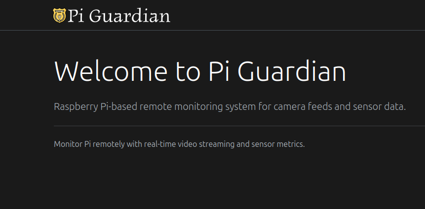

Author: Kristian Colville


# PiCam Guardian

**PiCam Guardian** | [Repository](https://github.com/KristianColville1/pi-cam-gaurdian)

**Smart Home Safety & Monitoring System**


## Presentation: https://iframe.mediadelivery.net/play/576582/6ffdfb02-97e0-4006-85c6-c4595eba6b6a

PiCam Guardian is an IoT-based smart home monitoring prototype that provides remote visibility into environmental conditions and activity using a Raspberry Pi with sensors and camera capabilities.


---

## Table of Contents

* [Project Goals](#project-goals)
  * [Personal Goals](#personal-goals)
* [User Experience (UX)](#user-experience-ux)
  * [Target Audience](#target-audience)
* [Design](#design)
  * [Color Scheme](#color-scheme)
  * [Typography](#typography)
  * [Layout](#layout)
  * [Icons](#icons)
* [Technologies &amp; Tools](#technologies--tools)
* [Features](#features)
  * [Baseline](#baseline)
  * [Release 1](#release-1)
  * [Release 2](#release-2)
  * [Release 3](#release-3)
* [System Design](#system-design)
* [Database Design](#database-design)
* [Development Log](#development-log)
* [Testing](#testing)
* [Bugs](#bugs)
  * [Bug Details](#bug-details)
* [Releases](#releases)
  * [Overview](#overview)
  * [Git Workflow](#git-workflow)
  * [Development Strategy](#development-strategy)
    * [Timeline](#timeline)
    * [Git Scope &amp; Branching](#git-scope--branching)
  * [Release Results](#release-results)
    * [Baseline](#baseline-1)
    * [Release 1](#release-1-1)
    * [Release 2](#release-2-1)
    * [Release 3](#release-3-1)
* [Development &amp; Deployment](#development--deployment)
  * [Version Control](#version-control)
  * [Cloning the Repository](#cloning-this-repository)
  * [Server Setup](#server-setup)
  * [Setting Up MQTT Mosquitto](#setting-up-mqtt-mosquitto)
* [Credits](#credits)

---

## Project Goals

PiCam Guardian aims to create a smart home monitoring system that provides real-time remote visibility into a physical space. The primary goal is to develop a low-latency camera streaming solution that enables remote monitoring with near-instantaneous feedback, making it feel like looking through a window rather than viewing a delayed video feed.

**Core Objectives:**

- **Remote Camera Access**: Primary goal is to access the camera feed remotely and see what's happening in real-time with minimal latency
- **Low-Latency Streaming**: Achieve sub-300ms latency for video streaming, making remote monitoring feel natural and responsive
- **Environmental Monitoring**: Collect and display real-time sensor data (temperature, humidity, pressure, motion) alongside video feed
- **Smart Home Integration**: Build a foundation for smart home safety and monitoring applications
- **Accessibility**: Create a system that can be used by various users, including elderly relatives who may benefit from remote monitoring solutions

### Personal Goals

As the primary developer and intended user of PiCam Guardian, this project serves multiple purposes:

- **Technical Learning**: Gain hands-on experience with IoT development, cloud infrastructure, networking, and real-time communication protocols
- **Practical Application**: Build a working system that solves a real need for remote monitoring and visibility
- **Performance Optimization**: Achieve and demonstrate low-latency streaming capabilities, with current implementation achieving ~220ms latency - effectively making it "may as well be a mirror" in terms of responsiveness
- **System Integration**: Learn to integrate multiple technologies (Raspberry Pi, cloud services, web technologies, protocols like RTSP, WebRTC, MQTT) into a cohesive system
- **Production Deployment**: Experience the full software development lifecycle from prototyping to deployment on cloud infrastructure

## User Experience (UX)

PiCam Guardian is designed to provide an intuitive, real-time monitoring experience that feels natural and responsive. The system prioritizes low latency and clear visual feedback to create a sense of presence and immediacy when monitoring a remote location.

**Core User Experience Principles:**

- **Immediate Feedback**: With ~220ms latency achieved, the video feed feels nearly instant, creating a mirror-like experience rather than traditional delayed video streaming
- **Real-Time Information**: Both video and sensor data update in real-time, providing comprehensive situational awareness
- **Simple Interface**: Clean, accessible web interface that doesn't require specialized software or complex setup
- **Remote Accessibility**: Access the system from anywhere with an internet connection through a standard web browser
- **Reliable Connection**: Robust error handling and automatic reconnection ensure continuous monitoring capabilities

### Target Audience

**Primary Audience: Developer/Owner**

As the primary intended user, the system is designed for personal use to:

- Monitor a space remotely with real-time video feed
- Keep track of environmental conditions and sensor readings
- Have peace of mind knowing what's happening in a monitored location
- Experience the benefits of a low-latency monitoring system for personal or professional use

**Secondary Audience: Elderly Care & Family Monitoring**

The system is designed to be adaptable for use cases such as:

- **Elderly Relatives**: Family members can remotely monitor elderly relatives to check on their well-being, see daily activity, and ensure safety
- **Pet Monitoring**: Check on pets when away from home
- **Home Security**: Monitor home entrances, common areas, or specific rooms for security purposes
- **Caregivers**: Professional or family caregivers can remotely check on individuals who need periodic monitoring

**User Requirements:**

- Basic web browser access (no specialized software needed)
- Internet connection (broadband recommended for optimal video quality)
- Mobile or desktop device (system is responsive and works on various screen sizes)
- No technical expertise required for end users (system setup is done by the developer/admin)

## Design

PiCam Guardian uses a modern, responsive web design approach built with React and Bootstrap, following atomic design principles for component organization.

**Technology Stack:**

- **React 19** - Modern React framework with hooks and context API
- **Vite** - Fast build tool and development server
- **React Bootstrap 2** - Bootstrap 5 components for React
- **React Router** - Client-side routing for single-page application
- **React Icons** - Icon library for UI elements

**Design Architecture:**

The frontend follows **atomic design principles**, organizing components into hierarchical levels:

- **Atoms** - Smallest reusable components (e.g., Brand component)
- **Molecules** - Simple component combinations
- **Organisms** - Complex UI components (Navigation, Footer, LoginModal, VideoStream, SensorDataTable)
- **Templates** - Page layout structures (PageTemplate)
- **Pages** - Complete page implementations (Home, Portal)

**Styling Approach:**

- **Bootstrap 5** - Utility-first CSS framework for responsive layout and components
- **Hamburgers** - Animated hamburger menu icons library (collapse variant) for navigation
- **CSS Variables** - Custom properties for theme management (light/dark mode)
- **Responsive Design** - Mobile-first approach with Bootstrap breakpoints
- **Theme Support** - Light and dark mode with user preference persistence

**Key Design Features:**

- Clean, minimal interface focused on functionality
- Real-time data visualization with live video and sensor metrics
- Accessible authentication flow with modal-based login
- Protected routes for authenticated content
- Consistent navigation and footer across all pages

## Technologies & Tools

**Frontend Technologies:**

- React 19
- Vite
- React Bootstrap 2
- React Router
- React Icons
- Axios
- Hamburgers
- Bootstrap 5

**Backend Technologies:**

- Node.js
- Express.js
- TypeORM
- SQLite (Better SQLite3)
- JSON Web Token (JWT)
- Bcrypt
- CORS
- Dotenv

**Raspberry Pi Application:**

- Python 3
- FastAPI
- Uvicorn
- Picamera2
- Paho MQTT
- Sense HAT
- FFmpeg

**Infrastructure & DevOps:**

- Oracle Cloud Infrastructure (OCI)
- Ubuntu 22.04 LTS
- Nginx
- MediaMTX
- Mosquitto MQTT Broker
- Let's Encrypt (Certbot)
- GitHub Actions (CI/CD)
- systemd
- iptables
- Bunny.net CDN (Storage Zones & Video Library)

**Development Tools:**

- Git
- Visual Studio Code
- ESLint
- npm / pip

## Features

### Baseline

**Programming & Networking Strands**

- Camera streaming infrastructure using `rpicam-vid` and `ffmpeg`
- RTSP streaming pipeline from Raspberry Pi to cloud server
- Oracle Cloud free tier server setup and configuration
- MediaMTX installation and systemd service configuration for RTSP/WebRTC streaming
- Network configuration (NSG rules, iptables, port forwarding)
- Low-latency video streaming (~220ms) via WebRTC
- Python streaming service (`stream.py`) with error handling and auto-restart
- Basic web interface with embedded WebRTC player
- Dynamic DNS setup for remote access preparation

### Release 1

**Sensor Data Collection & Real-Time Updates**

- MQTT broker (Mosquitto) installation and configuration on cloud server
- MQTT server listening on ports 1883 (standard MQTT) and 9001 (WebSocket)
- Sense HAT sensor metrics collection via `metrics.py`
- Real-time sensor data publishing to MQTT broker (temperature, humidity, pressure, orientation, acceleration)
- WebSocket connection from frontend to MQTT broker
- Dynamic table updates in web interface for real-time sensor data
- Complete end-to-end data flow: Raspberry Pi sensors → MQTT → Frontend display
- Systemd service configuration for metrics collection service
- Network configuration for MQTT ports (1883 and 9001)

### Release 2

**Public Website & Database Integration**

- Development of public-facing website interface
- Implementation of database concepts from database design strand
- Historical data storage and retrieval capabilities
- Enhanced user interface and user experience features

### Release 3

**Media Capture, Storage & Management**

- Image capture functionality from Raspberry Pi camera
- Video recording capabilities with multi-channel streaming
- Bunny.net CDN integration for media storage (static assets and video library)
- Storage management system with File and Recording entities
- Webhook integration for recording status updates from Bunny.net
- Storage management interface with pagination, filtering, and editing capabilities
- Remote camera control through backend API integration
- Media metadata tracking (file size, duration, status, timestamps)
- Unified camera service architecture with pause recording pattern for stability

## System Design

The system architecture, component design, and technical specifications for PiCam Guardian are documented in detail in the [System Design Document (SDD)](docs/SDD/index.md).

The SDD covers architecture overview, system components, network architecture, data flow, API design, security considerations, and deployment architecture.

[View System Design Document →](docs/SDD/index.md)

---

## Database Design

The database schema, data models, relationships, and storage design for PiCam Guardian are documented in detail in the [Database Design Document (DDD)](docs/DDD/index.md).

The DDD covers database schema, entity relationships, data models, tables, indexes, and constraints.

[View Database Design Document →](docs/DDD/index.md)

---

## Development Log

The development log provides insight into the development process, documenting the journey from initial concepts to implementation. These entries capture procedural notes, challenges encountered, solutions explored, and the iterative thought process behind design decisions.

These logs are journal-style entries intended to give readers insight into the development experience rather than serving as step-by-step documentation or tutorials.

[View Development Log Index →](docs/dev-log/index.md)

---

## Testing

## Bugs

1: The camera falls over after a period of time, suspect its the ffmpeg process and checking the camera is actually available.

### Bug Details

## Releases

### Overview

### Git Workflow

### Development Strategy

The assignment is delivered in multiple iterations:

- **Baseline**
- **Release 1** → **Release 3**
- **Release 4** and beyond (if time permits)

The development approach follows an agile methodology with a focus on rapid prototyping and iterative refinement. The strategy moves from the most abstract concepts to concrete implementations, starting with minimal viable products (MVPs) and progressively optimizing toward production-ready solutions.

**Core Principles:**

- **Abstract to Concrete**: Begin with high-level architecture and system design, then progressively implement specific components
- **Rapid Prototyping**: Quickly build working prototypes to validate concepts and identify challenges early
- **Optimization Iteration**: Each release refines and optimizes previous implementations based on learnings
- **Continuous Mini-MVPs**: Each iteration delivers a functional, testable product that builds upon previous releases
- **Agile Adaptation**: Respond to technical challenges and requirements changes through flexible, iterative development

This approach ensures early validation of core functionality while maintaining flexibility to refine and optimize based on real-world testing and feedback.

#### Timeline

| Milestone                 | Date           |
| ------------------------- | -------------- |
| Project Start             | Dec 7th, 2025  |
| Development Start         | Dec 28th, 2025 |
| Expected Final Submission | Jan 8th, 2026  |
| Approximate Duration      | 5/6 weeks      |

#### Git Scope & Branching

| Branch       | Description                   |
| ------------ | ----------------------------- |
| `main`     | Stable, release-ready version |
|              |                               |
| `baseline` | Baseline project              |
| `rel1`     | Release 1                     |
| `rel2`     | Release 2                     |
| `rel3`     | Release 3                     |

### Release Results

#### Baseline

Successfully established the core networking and programming infrastructure for the camera streaming system. The baseline release focused on proving the concept and establishing a working video streaming pipeline from the Raspberry Pi to a remote server.

**Achievements:**

- **Video Streaming Pipeline**: Implemented end-to-end RTSP streaming from Raspberry Pi camera to Oracle Cloud server using `rpicam-vid` piped through `ffmpeg`
- **Low Latency Streaming**: Achieved ~220ms latency using WebRTC through MediaMTX, exceeding industry standards for live streaming
- **Cloud Infrastructure**: Successfully configured Oracle Cloud free tier instance with proper network security groups, iptables rules, and port management
- **Service Automation**: Configured systemd services for MediaMTX and streaming processes to ensure automatic startup and resilience
- **Network Configuration**: Resolved complex cloud networking challenges including NSG rules, VNIC configuration, and firewall settings
- **Streaming Service**: Developed robust Python streaming service with error handling, process monitoring, and auto-restart capabilities

**Current State:**

The baseline release provides a functional streaming system with camera feed accessible via WebRTC through a web interface.

**Development Approach:**

Implementing a cloud server setup early in the baseline release presented scope and time risks, but was approached from an MVP perspective to validate core infrastructure and networking concepts. Heavy refinements for security hardening, performance optimization, and production-ready configurations are planned for future iterations, allowing the baseline to focus on establishing a working foundation.

**Prepared for Future Releases:**

Networking infrastructure and streaming pipeline are established and ready for integration with additional features such as sensor data collection, database storage, authentication systems, and enhanced user interfaces.

#### Release 1

Successfully implemented sensor data collection and real-time data transmission infrastructure. Release 1 builds upon the baseline streaming foundation by adding comprehensive sensor monitoring capabilities.

**Achievements:**

- **MQTT Infrastructure**: Configured Mosquitto MQTT broker on the cloud server with dual-protocol support (standard MQTT on port 1883 and WebSocket on port 9001)
- **Sensor Data Collection**: Implemented `metrics.py` service to collect Sense HAT sensor metrics including temperature (from humidity and pressure sensors), humidity, pressure, orientation (pitch, roll, yaw), and acceleration (x, y, z axes)
- **Real-Time Data Publishing**: Established continuous data flow with metrics published to MQTT broker every 2 seconds
- **WebSocket Integration**: Enabled WebSocket connections from web frontend to MQTT broker for real-time data reception
- **Dynamic Frontend Updates**: Implemented real-time table updates in web interface, displaying live sensor data as it's received
- **Service Automation**: Configured systemd service for metrics collection with proper error handling and logging
- **Network Configuration**: Configured firewall rules and security groups for MQTT ports (1883 and 9001)

**Current State:**

Release 1 provides a complete real-time monitoring system with both video streaming (from baseline) and sensor data collection. The system demonstrates full end-to-end data flow from Raspberry Pi sensors through MQTT to the web frontend, with all data updating in real-time.

**Prepared for Future Releases:**

The MQTT infrastructure and real-time data flow established in Release 1 provides the foundation for database integration, historical data storage, and advanced analytics features planned for Release 2.

#### Release 2

Successfully implemented a public-facing website with full-stack architecture, database integration, authentication system, and production deployment infrastructure. Release 2 transforms the system from a prototype into a production-ready web application accessible via public domain.

**Achievements:**

- **Domain & DNS Configuration**: Purchased and configured domain (pi-guardian.kcolville.com) with Cloudflare DNS, set up reserved IP address on Oracle Cloud for stable public access
- **Backend Infrastructure**: Built Express.js backend with TypeORM for database abstraction, SQLite database for local development, modular architecture using Domain-Driven Design principles, ES Modules support, decorator-based controller system, JWT authentication middleware
- **Frontend Infrastructure**: Created React application with Vite build system, React Bootstrap for UI components, atomic design architecture for component organization, React Router for client-side routing, authentication context and protected routes, responsive design with theme support (light/dark mode)
- **Database Integration**: Implemented TypeORM entity system, SQLite database initialization, user authentication entities and relationships, database seeding scripts for initial admin account, prepared architecture for future data persistence
- **Production Deployment**: Configured Nginx reverse proxy for frontend, backend API, and WebSocket connections, implemented SSL/TLS with Let's Encrypt certificates via Certbot, automated HTTP to HTTPS redirection, configured systemd services for backend process management, deployed frontend static files and backend application to cloud server
- **WebSocket Security**: Resolved WSS (WebSocket Secure) connection issues through nginx proxy configuration, implemented proper WebSocket upgrade headers for secure MQTT connections, ensured all production traffic uses HTTPS/WSS protocols
- **UI/UX Enhancements**: Created logo and favicon assets, implemented modern web interface with React Bootstrap components, developed authentication flow with login modal and protected routes, integrated video stream and sensor data display into React components, improved user experience with theme switching and responsive layout

**Current State:**

Release 2 provides a fully functional public-facing web application accessible at https://pi-guardian.kcolville.com. The system includes a complete authentication system, database infrastructure, and production-ready deployment configuration. Users can access the system securely via HTTPS, authenticate to view the monitoring portal, and access real-time video and sensor data through a modern web interface.

**Technical Highlights:**

- **Low Latency Maintained**: Despite adding full-stack architecture and production infrastructure, the system maintains ~220ms video latency, preserving the "mirror-like" experience from baseline
- **Secure Production Environment**: All traffic encrypted with SSL/TLS, secure authentication system, protected routes, and secure WebSocket connections
- **Scalable Architecture**: Modular backend design, database abstraction layer, and component-based frontend architecture provide foundation for future feature expansion
- **Production Challenges Resolved**: Addressed nginx proxy configuration issues, WebSocket upgrade problems, port configuration errors, and deployment workflow challenges

**Prepared for Future Releases:**

The database infrastructure and authentication system established in Release 2 provides the foundation for data persistence, historical data storage, user management, and advanced features planned for Release 3. The production deployment pipeline and infrastructure are now established for continued development and deployment.

#### Release 3

Successfully implemented media capture, storage infrastructure, and content management capabilities. Release 3 builds upon the production-ready foundation from Release 2 by adding comprehensive media capture functionality, CDN integration, and storage management features that enable users to capture, store, and manage images and video recordings.

**Achievements:**

- **Backend TypeScript Migration**: Converted Express.js backend from JavaScript to TypeScript, maintaining loose typing approach for minimal codebase complexity while gaining type safety benefits, updated build configuration and route detection for TypeScript file extensions
- **Database Entities**: Implemented File and Recording entities with TypeORM schemas, supporting metadata storage for images and video recordings including file paths, CDN URLs, sizes, durations, status tracking, and soft delete capabilities
- **CDN Infrastructure**: Integrated Bunny.net CDN service with storage zone (pi-guardian) for static asset hosting, video library (pi-guardian-recordings) for video storage and streaming, pull zone configuration (pi-guardian.b-cdn.net) for content delivery, webhook endpoint setup for recording status updates
- **Raspberry Pi Camera Integration**: Implemented FastAPI-based camera service with unified process management, image capture functionality with automatic upload to Bunny.net storage, video recording with multi-channel streaming support, pause recording pattern to prevent camera interruptions, FFmpeg integration for video encoding and containerization, remote API access via No-IP dynamic DNS
- **Storage Module**: Created comprehensive storage module with repository pattern (FileRepository, RecordingRepository), HTTP handlers for CRUD operations, controller endpoints with OpenAPI documentation, PATCH endpoints for updating file and recording metadata, webhook handler for recording status updates from Bunny.net, BunnyManager for fetching video metadata (file size, duration) from CDN API
- **Frontend Storage Management**: Developed Storage page with tabbed interface (Files, Recordings), responsive tables with pagination (max 10 rows per page), filtering capabilities (file type, status, sorting options), edit functionality with modal dialogs for renaming recordings, view modals for images and video playback, delete functionality with confirmation dialogs, Bootstrap table components with button groups for actions
- **API Integration**: Created storage API client with full CRUD operations, integrated PATCH endpoints for metadata updates, webhook endpoint for Bunny.net status callbacks, Pi Guard API documentation page, camera control API endpoints (capture, record, stop)
- **Portal Enhancements**: Added Actions dropdown to navigation for global camera controls, simplified Portal content tabs to focus on Events, improved UI with consistent button styling and responsive design, integrated camera actions with recording state management via context
- **Recording Status Management**: Implemented status code mapping (0-5: Queued, Processing, Encoding, Finished, Resolution Finished, Failed), automatic metadata fetching from Bunny.net on status updates, unified webhook handler to process all status codes, recording state synchronization across components via React context

**Current State:**

Release 3 provides a complete media capture and management system. Users can remotely capture images and record videos from the Raspberry Pi camera, with all media automatically uploaded to Bunny.net CDN. The storage management interface allows users to view, filter, edit, and delete files and recordings with a modern, responsive UI. Recording status updates are automatically processed via webhooks, and video metadata (size, duration) is fetched from Bunny.net API.

**Technical Highlights:**

- **Multi-Channel Camera Architecture**: Implemented pause recording pattern to maintain camera stability, enabling seamless switching between live streaming, image capture, and video recording without camera interruptions
- **CDN Integration**: Full integration with Bunny.net for both static asset storage (images) and video library (recordings), with automatic upload, webhook status updates, and metadata synchronization
- **Modular Backend Architecture**: Storage module follows repository pattern with clean separation of concerns, manager layer for external API interactions, and consistent error handling
- **TypeScript Migration**: Backend converted to TypeScript with minimal complexity, maintaining development velocity while gaining type safety benefits
- **Production-Ready Storage Management**: Complete CRUD operations, pagination, filtering, and editing capabilities with intuitive UI and proper error handling

**Prepared for Future Releases:**

The media capture and storage infrastructure established in Release 3 provides the foundation for advanced features such as scheduled recordings, motion detection triggers, automated archival, enhanced analytics, and expanded media processing capabilities. The CDN integration and webhook system enable real-time status updates and scalable media delivery.

## Development & Deployment

### Version Control

The project uses [Visual Studio Code](https://code.visualstudio.com/) as the local IDE and [GitHub](https://github.com/KristianColville1/pi-cam-gaurdian) as the remote repository.

**Basic Git Workflow:**

- `git add <file>` - Stage files for commit
- `git commit -m "message"` - Commit changes with descriptive message
- `git push` - Push changes to GitHub

For detailed deployment architecture, server setup, service configuration, and CI/CD workflows, see the [Deployment Documentation](docs/SDD/deployment.md).

### Cloning this Repository

If you would like to clone this repository please follow the bellow steps.

Instructions:

1. Log into GitHub.
2. Go to the repository you wish to clone.
3. Click the green "Code" button.
4. Copy the URL provided under the HTTPS option.
5. Open your preferred IDE with Git installed.
6. Open a new terminal window in your IDE.
7. Enter the following command exactly: `git clone the-URL-you-copied-from-GitHub`.
8. Press Enter.

### Server Setup

The cloud infrastructure for PiCam Guardian is hosted on Oracle Cloud Infrastructure (OCI) using the free tier offering. The server runs Ubuntu 22.04 LTS on a dedicated VPS instance.

**Infrastructure Overview:**

- **Provider**: Oracle Cloud Infrastructure (Free Tier)
- **Operating System**: Ubuntu 22.04 LTS
- **Domain**: pi-guardian.kcolville.com
- **Services**: MediaMTX (RTSP/WebRTC), Mosquitto (MQTT), Nginx (Reverse Proxy), Backend API (Node.js)

For detailed server setup instructions, including Oracle Cloud configuration, SSH key setup, network configuration, and service installation, see the [Deployment Documentation](docs/SDD/deployment.md).

### Raspberry Pi Development (pi-guard)

The Raspberry Pi application (`pi-guard`) is developed on the Pi and can be synced back to the local repository for version control.

**Pulling Changes from Raspberry Pi:**

To pull changes made on the Raspberry Pi back to the local repository:

```bash
rsync -avz --exclude '.venv' --exclude '__pycache__' --exclude '*.pyc' kristian@192.168.178.99:/home/kristian/Documents/pi-guard/ /home/kristian/Documents/GitHub/pi-cam-gaurdian/pie/pi-guard/
```

**Note:** Replace `kristian` with your Pi username if different, and adjust the IP address (`192.168.178.99`) if your Pi's network address has changed.

**Exclusions:**

- `.venv` - Virtual environment folder
- `__pycache__` - Python cache directories
- `*.pyc` - Compiled Python files

For detailed Raspberry Pi application deployment and configuration, see the [Deployment Documentation](docs/SDD/deployment.md#raspberry-pi-deployment).

### CI/CD Pipeline (GitHub Actions)

Frontend deployment is automated using GitHub Actions CI/CD workflows. When changes are pushed to the `frontend/dist/` directory, the workflow automatically:

1. Connects to the server via SSH using the `SERVER_SSH_KEY` secret
2. Removes the existing remote dist folder completely
3. Deploys the new dist folder using rsync (1:1 synchronization, no remnants)
4. Reloads nginx to serve the updated files

**Workflow File:** `.github/workflows/frontend-dist.yml`

**Configuration Requirements:**

- GitHub secret `SERVER_SSH_KEY`: Private SSH key for server authentication
- Automatic trigger on push to `frontend/dist/**` path

For detailed GitHub Actions CI/CD workflow configuration and setup instructions, see the [Deployment Documentation](docs/SDD/deployment.md#cicd-pipeline-github-actions).

### Nginx & SSL Configuration

Nginx serves as a reverse proxy for the frontend, backend API, camera streaming, and WebSocket connections. SSL/TLS certificates are automatically managed through Let's Encrypt using Certbot.

**Key Features:**

- Automatic HTTP to HTTPS redirect
- SSL certificate auto-renewal via Certbot
- Reverse proxy for backend API (port 3000)
- WebSocket proxy for MQTT (port 9001) and camera streaming (port 8889)
- Static file serving for React frontend

For detailed nginx configuration, SSL setup, and troubleshooting, see the [Deployment Documentation](docs/SDD/deployment.md#nginx-configuration-details).

### MQTT Mosquitto Setup

Mosquitto MQTT broker is installed and configured on the cloud server to handle sensor data publishing from the Raspberry Pi.

**Configuration:**

- **Ports**: 1883 (standard MQTT), 9001 (WebSocket)
- **Service**: systemd service (auto-start on boot)
- **Status**: Enabled and running

For detailed Mosquitto installation, configuration, and network setup instructions, see the [Deployment Documentation](docs/SDD/deployment.md#cloud-server-deployment).

## Credits

---

**Navigation**

[← Previous Section]() | [Table of Contents](README.md) | [Next Section →]()

---

**PiCam Guardian** | [Repository](https://github.com/KristianColville1/pi-cam-gaurdian)

<!-- Footer Component: README/footer.md -->
