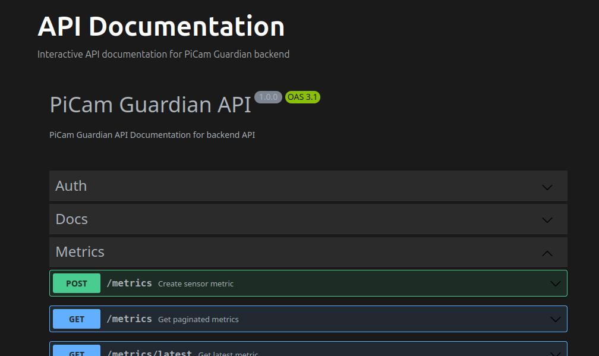

# API Design

**PiCam Guardian - API Specification**

https://pi-guardian.kcolville.com/api-docs



## API Overview

PiCam Guardian uses a combination of MQTT for real-time sensor data and REST APIs for application functionality. The system follows a publish-subscribe pattern for real-time data distribution and RESTful principles for resource management and control operations.

**API Types:**

- **MQTT API**: Real-time sensor data publishing (WebSocket and standard MQTT)
- **REST API**: Authentication, storage management, camera control, metrics, and webhooks
- **Webhook API**: External service callbacks (Bunny.net CDN)

**Base URL**: `https://pi-guardian.kcolville.com/api`

**Authentication**: Most endpoints require JWT authentication via session cookies. Public endpoints are marked accordingly.

## MQTT API

### Broker Configuration

- **Broker Address**: 145.241.195.101
- **Standard MQTT Port**: 1883
- **WebSocket Port**: 9001
- **Protocol**: MQTT 3.1.1
- **Broker Software**: Mosquitto

### Topics

#### sensors/metrics

**Description**: Real-time sensor data from Raspberry Pi Sense HAT

**Topic**: `sensors/metrics`

**Publisher**: Raspberry Pi (`metrics.py`)

**Subscribers**: Frontend web clients, future database services

**Message Format**: JSON

**Publish Frequency**: Every 2 seconds

**Message Schema**:

```json
{
  "temp_humidity": 23.5,
  "temp_pressure": 24.1,
  "humidity": 45.2,
  "pressure": 1013.25,
  "pitch": 2.3,
  "roll": -1.8,
  "yaw": 89.5,
  "accel_x": 0.02,
  "accel_y": -0.01,
  "accel_z": 0.98
}
```

**Field Descriptions**:

| Field             | Type   | Description                      | Unit |
| ----------------- | ------ | -------------------------------- | ---- |
| `temp_humidity` | number | Temperature from humidity sensor | °C  |
| `temp_pressure` | number | Temperature from pressure sensor | °C  |
| `humidity`      | number | Relative humidity                | %    |
| `pressure`      | number | Atmospheric pressure             | mbar |
| `pitch`         | number | Orientation pitch angle          | °   |
| `roll`          | number | Orientation roll angle           | °   |
| `yaw`           | number | Orientation yaw angle            | °   |
| `accel_x`       | number | Acceleration on X axis           | g    |
| `accel_y`       | number | Acceleration on Y axis           | g    |
| `accel_z`       | number | Acceleration on Z axis           | g    |

**Example Message**:

```json
{
  "temp_humidity": 23.5,
  "temp_pressure": 24.1,
  "humidity": 45.2,
  "pressure": 1013.25,
  "pitch": 2.3,
  "roll": -1.8,
  "yaw": 89.5,
  "accel_x": 0.02,
  "accel_y": -0.01,
  "accel_z": 0.98
}
```

## Client Connection Examples

### Python Publisher (metrics.py)

```python
import paho.mqtt.client as mqtt
import json

mqtt_client = mqtt.Client(transport="websockets")
mqtt_client.connect("145.241.195.101", 9001, 60)
mqtt_client.loop_start()

metrics = {
    "temp_humidity": 23.5,
    "temp_pressure": 24.1,
    # ... other fields
}
payload = json.dumps(metrics)
mqtt_client.publish("sensors/metrics", payload)
```

### JavaScript Subscriber (Frontend)

```javascript
const client = new Paho.Client("145.241.195.101", 9001, "client_id");
client.connect({
    onSuccess: function() {
        client.subscribe("sensors/metrics");
    }
});

client.onMessageArrived = function(message) {
    const metrics = JSON.parse(message.payloadString);
    // Update UI with metrics
};
```

## REST API

### Authentication Endpoints

#### POST `/api/auth/login`

Authenticate user with email and password, returning user profile and session cookie.

**Request Body:**

```json
{
  "email": "user@example.com",
  "password": "password123"
}
```

**Response:** 200 OK

```json
{
  "user": {
    "id": "uuid",
    "email": "user@example.com",
    "name": "User Name"
  }
}
```

**Error Responses:**

- 400: Validation error
- 401: Invalid credentials

---

#### POST `/api/auth/register`

Create a user account and start an authenticated session.

**Request Body:**

```json
{
  "email": "user@example.com",
  "password": "password123",
  "name": "User Name"
}
```

**Response:** 201 Created

**Error Responses:**

- 400: Validation error
- 409: Email already registered

---

#### POST `/api/auth/logout`

Invalidate the active session cookie. Requires authentication.

**Response:** 200 OK

**Error Responses:**

- 401: Authentication required

---

#### GET `/api/auth/me`

Return the authenticated user profile. Requires authentication.

**Response:** 200 OK

```json
{
  "id": "uuid",
  "email": "user@example.com",
  "name": "User Name",
  "created_at": "2026-01-01T00:00:00Z"
}
```

**Error Responses:**

- 401: Authentication required
- 404: User not found

---

### Storage Endpoints

#### Files

##### GET `/api/storage/files`

Get a paginated list of files with optional filtering and sorting.

**Query Parameters:**

- `page` (integer, default: 1): Page number
- `limit` (integer, default: 50, max: 100): Items per page
- `sort` (string, default: "created_at"): Sort field
- `order` (enum: "ASC" | "DESC", default: "DESC"): Sort order
- `file_type` (string, optional): Filter by file type

**Response:** 200 OK

```json
{
  "data": [...],
  "pagination": {
    "page": 1,
    "limit": 50,
    "total": 100,
    "totalPages": 2
  }
}
```

---

##### GET `/api/storage/files/:id`

Get a single file by its ID.

**Response:** 200 OK

```json
{
  "id": "uuid",
  "object_name": "snapshot.jpg",
  "path": "images/2026/01/08/snapshot.jpg",
  "file_type": "image/jpeg",
  "file_size": 123456,
  "created_at": "2026-01-08T10:00:00Z"
}
```

**Error Responses:**

- 404: File not found

---

##### PUT `/api/storage/files/:id`

Update file metadata. Requires authentication.

**Request Body:**

```json
{
  "title": "Updated Title",
  "metadata": {},
  "file_type": "image/jpeg"
}
```

**Response:** 200 OK

**Error Responses:**

- 401: Authentication required
- 404: File not found

---

##### PATCH `/api/storage/files/:id`

Update file name/title. Requires authentication.

**Request Body:**

```json
{
  "title": "New File Name"
}
```

**Response:** 200 OK

**Error Responses:**

- 401: Authentication required
- 404: File not found

---

##### DELETE `/api/storage/files/:id`

Soft delete a file by its ID. Also deletes from CDN. Requires authentication.

**Response:** 200 OK

**Error Responses:**

- 401: Authentication required
- 404: File not found

---

#### Recordings

##### GET `/api/storage/recordings`

Get a paginated list of recordings with optional filtering and sorting.

**Query Parameters:**

- `page` (integer, default: 1): Page number
- `limit` (integer, default: 50, max: 100): Items per page
- `sort` (string, default: "created_at"): Sort field
- `order` (enum: "ASC" | "DESC", default: "DESC"): Sort order
- `status` (string, optional): Filter by status

**Response:** 200 OK

---

##### GET `/api/storage/recordings/:id`

Get a single recording by its ID.

**Response:** 200 OK

```json
{
  "id": "uuid",
  "title": "Recording Title",
  "video_id": "video-guid",
  "status": "finished",
  "file_size": 567890,
  "duration": 120,
  "created_at": "2026-01-08T10:00:00Z",
  "uploaded_at": "2026-01-08T10:02:00Z"
}
```

**Error Responses:**

- 404: Recording not found

---

##### PUT `/api/storage/recordings/:id`

Update recording metadata. Requires authentication.

**Request Body:**

```json
{
  "title": "Updated Title",
  "metadata": {},
  "status": "finished"
}
```

**Response:** 200 OK

**Error Responses:**

- 401: Authentication required
- 404: Recording not found

---

##### PATCH `/api/storage/recordings/:id`

Update recording name/title. Requires authentication.

**Request Body:**

```json
{
  "title": "New Recording Name"
}
```

**Response:** 200 OK

**Error Responses:**

- 401: Authentication required
- 404: Recording not found

---

##### DELETE `/api/storage/recordings/:id`

Soft delete a recording by its ID. Also deletes from CDN. Requires authentication.

**Response:** 200 OK

**Error Responses:**

- 401: Authentication required
- 404: Recording not found

---

### Pi Guard (Camera Control) Endpoints

#### GET `/api/pi-guard/endpoints`

Retrieve a list of available endpoints from the pi-guard service.

**Response:** 200 OK

---

#### GET `/api/pi-guard/health`

Check the health status of the pi-guard service.

**Response:** 200 OK

---

#### GET `/api/pi-guard/camera/capture`

Capture a snapshot image from the Raspberry Pi camera. Requires authentication.

**Response:** 200 OK

```json
{
  "success": true,
  "file_path": "images/2026/01/08/snapshot.jpg",
  "url": "https://uk.storage.bunnycdn.com/images/2026/01/08/snapshot.jpg",
  "message": "Image captured successfully"
}
```

**Error Responses:**

- 401: Authentication required
- 503: Camera service not available
- 500: Failed to capture image

---

#### GET `/api/pi-guard/camera/recording/start`

Start recording video from the Raspberry Pi camera. Requires authentication.

**Response:** 200 OK

**Error Responses:**

- 401: Authentication required
- 409: Recording already in progress
- 503: Camera service not available
- 500: Failed to start recording

---

#### GET `/api/pi-guard/camera/recording/stop`

Stop the current video recording and upload the MP4 file. Requires authentication.

**Response:** 200 OK

```json
{
  "success": true,
  "video_guid": "video-guid",
  "message": "Recording stopped and uploaded successfully"
}
```

**Error Responses:**

- 401: Authentication required
- 409: No recording in progress
- 503: Camera service not available
- 500: Failed to stop recording

---

#### GET `/api/pi-guard/camera/recording/status`

Get the current recording status (whether recording is in progress).

**Response:** 200 OK

```json
{
  "is_recording": false
}
```

---

### Metrics Endpoints

#### POST `/api/metrics`

Create a new sensor metric entry. Can be called from Pi to store metrics.

**Request Body:**

```json
{
  "device_id": "uuid",
  "temp_humidity": 23.5,
  "temp_pressure": 24.1,
  "humidity": 45.2,
  "pressure": 1013.25,
  "pitch": 2.3,
  "roll": -1.8,
  "yaw": 89.5,
  "accel_x": 0.02,
  "accel_y": -0.01,
  "accel_z": 0.98
}
```

**Response:** 201 Created

---

#### GET `/api/metrics`

Get a paginated list of sensor metrics with optional filtering and sorting.

**Query Parameters:**

- `page` (integer, default: 1)
- `limit` (integer, default: 50, max: 100)
- `sort` (string, default: "created_at")
- `order` (enum: "ASC" | "DESC", default: "DESC")
- `device_id` (string, optional)
- `start_date` (datetime, optional)
- `end_date` (datetime, optional)

**Response:** 200 OK

---

#### GET `/api/metrics/latest`

Get the most recent sensor metric, optionally filtered by device.

**Query Parameters:**

- `device_id` (string, optional)

**Response:** 200 OK

**Error Responses:**

- 404: No metrics found

---

#### GET `/api/metrics/statistics`

Get aggregated statistics for sensor metrics with optional filtering.

**Query Parameters:**

- `device_id` (string, optional)
- `start_date` (datetime, optional)
- `end_date` (datetime, optional)

**Response:** 200 OK

---

#### GET `/api/metrics/:id`

Get a single sensor metric by its ID.

**Response:** 200 OK

**Error Responses:**

- 404: Metric not found

---

#### DELETE `/api/metrics/:id`

Delete a sensor metric by its ID. Requires authentication.

**Response:** 200 OK

**Error Responses:**

- 401: Authentication required
- 404: Metric not found

---

### Webhook Endpoints

#### POST `/api/webhooks/recordings`

Receives webhooks from Bunny.net video library when recording processing status changes.

**Request Body:**

```json
{
  "VideoLibraryId": 12345,
  "VideoGuid": "video-guid",
  "Status": 3
}
```

**Status Codes:**

- 0: Queued
- 1: Processing
- 2: Encoding
- 3: Finished
- 4: Resolution finished
- 5: Failed

**Response:** 200 OK

```json
{
  "success": true,
  "message": "Status 3 processed successfully"
}
```

**Error Responses:**

- 400: Missing required fields
- 500: Internal server error

---

### Documentation Endpoints

#### GET `/api/docs/openapi.json`

Returns the OpenAPI 3.1 specification for the API, generated from controller decorators.

**Response:** 200 OK (JSON)

---

#### GET `/api/docs/pi-guard/openapi.json`

Returns the OpenAPI specification from the pi-guard (Raspberry Pi) service.

**Response:** 200 OK (JSON)

---

## API Documentation Notes

- **Authentication**: Most endpoints require JWT authentication via session cookies. Authentication is handled automatically by the browser for web clients.
- **Pagination**: List endpoints support pagination with `page` and `limit` query parameters.
- **Filtering**: Many list endpoints support filtering via query parameters.
- **Error Handling**: All endpoints return standard HTTP status codes with JSON error responses.
- **API Version**: Current API version is 1.0 (subject to change in future releases)
- **OpenAPI Specification**: Full API documentation is available at `/api/docs/openapi.json`

## Future API Considerations

- WebSocket API for bidirectional control commands and real-time updates
- Enhanced authentication and authorization APIs (OAuth, API keys)
- Configuration API for system settings
- Batch operations for storage management
- Real-time notifications via WebSocket

---

**Navigation**

[← Previous Section](data-flow.md) | [Table of Contents](index.md) | [Next Section →](security.md)

---

**PiCam Guardian** | [Repository](https://github.com/KristianColville1/pi-cam-gaurdian)
