# Deployment Architecture

**PiCam Guardian - Deployment & Infrastructure**

## Deployment Overview

PiCam Guardian is deployed across two primary environments: the Raspberry Pi edge device and the Oracle Cloud Infrastructure server.

## Deployment Architecture Diagram

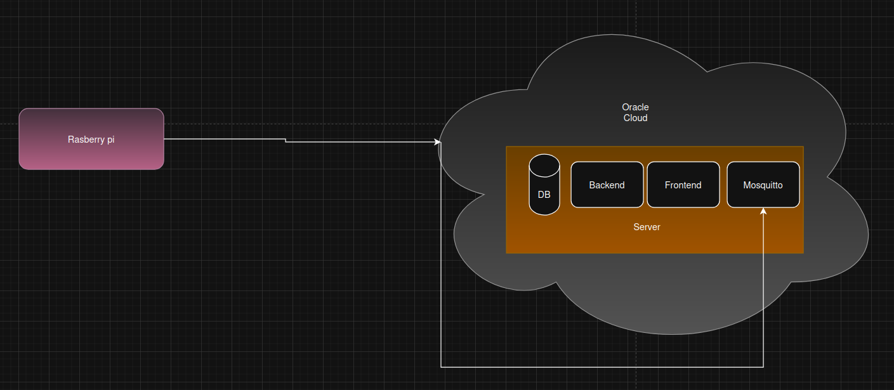

## Raspberry Pi Deployment

### Hardware Requirements

- Raspberry Pi board (model with camera support)
- Raspberry Pi Camera Module
- Sense HAT add-on board
- Network connectivity (WiFi or Ethernet)
- Power supply
- SD card for operating system

### Software Deployment

#### Operating System

- Raspberry Pi OS (recommended)
- Linux-based distribution with camera and Sense HAT support

#### Pi-Guard Application (FastAPI)

The Raspberry Pi runs a unified FastAPI application (`pi-guard`) that consolidates camera streaming, metrics collection, and sensor data publishing into a single service.

**Application Structure:**

- **Location**: `pie/pi-guard/`
- **Main Entry Point**: `main.py`
- **Services**: CameraService, StreamingService, MetricsService
- **Framework**: FastAPI with uvicorn

**Service Components:**

1. **CameraService** (`modules/camera/service.py`)

   - Manages Picamera2 camera interface
   - Provides H.264 encoder output for streaming
   - Configuration: Resolution, bitrate from settings
2. **StreamingService** (`modules/streaming/service.py`)

   - Streams camera feed to RTSP server via ffmpeg
   - Uses Picamera2 H.264 encoder output
   - Monitors streaming process health and auto-restarts
3. **MetricsService** (`modules/metrics/service.py`)

   - Collects Sense HAT sensor data
   - Publishes metrics to MQTT broker via WebSocket
   - Publishes at configurable interval (default: 2 seconds)

**Service Deployment (systemd)**

- **Service File**: `/etc/systemd/system/pi-guard.service` (planned)
- **Purpose**: Unified camera streaming and metrics collection service
- **Configuration**: Auto-start on boot, restart on failure
- **Dependencies**:
  - Python 3
  - picamera2
  - paho-mqtt
  - sense-hat
  - fastapi, uvicorn
  - ffmpeg (for RTSP streaming)

**Configuration:**

- Environment variables loaded from `.env` file (via python-dotenv)
- Required variables: `MQTT_BROKER`, `RTSP_URL`
- Optional variables: `MQTT_PORT`, `STREAM_RESOLUTION`, `STREAM_FRAMERATE`, `STREAM_BITRATE`, `METRICS_PUBLISH_INTERVAL`, `LOG_LEVEL`, `DEBUG`

#### Installation Steps

1. Install operating system and dependencies
2. Configure camera module and Sense HAT
3. Install Python dependencies from `requirements.txt`
4. Configure environment variables (`.env` file)
5. Deploy service file to systemd
6. Enable and start service
7. Configure network connectivity

## Cloud Server Deployment

### Infrastructure

- **Provider**: Oracle Cloud Infrastructure (Free Tier)
- **Instance Type**: VM.Standard.E2.1.Micro (Free Tier eligible)
- **Operating System**: Ubuntu 22.04 LTS
- **Public IP**: 145.241.195.101
- **Region**: Oracle Cloud region (specific region TBD)

### Oracle Cloud Initial Setup

**Initial Setup Process:**

1. **Oracle Cloud Account Creation**

   - Signed up for Oracle Cloud free tier account
   - Accessed the Oracle Cloud Console

   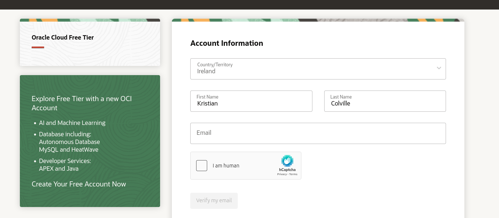
   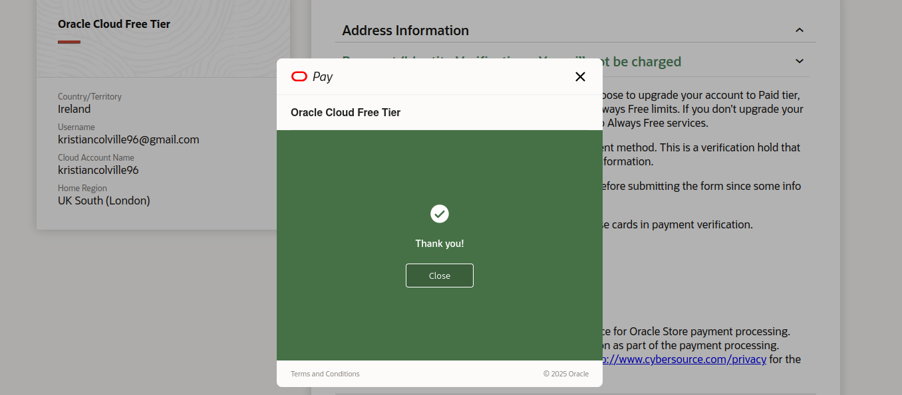
2. **Instance Creation**

   - Created a compute instance with default settings
   - Configured necessary settings and resolved initial setup errors

   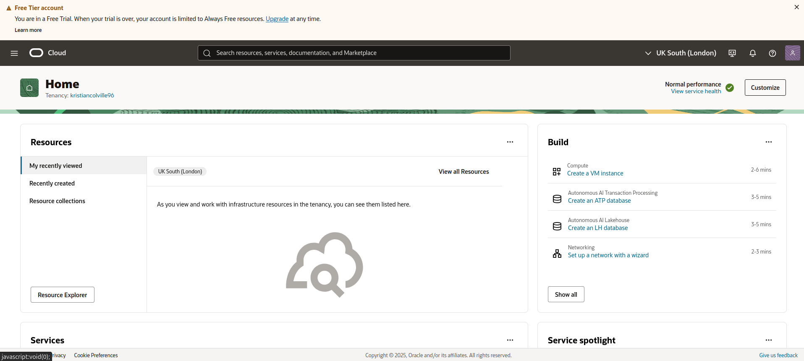
   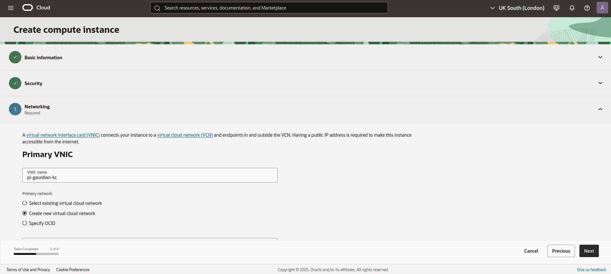
3. **SSH Key Configuration**

   - Encountered SSH key download error during initial setup
   - Downloaded SSH keys from networking section

   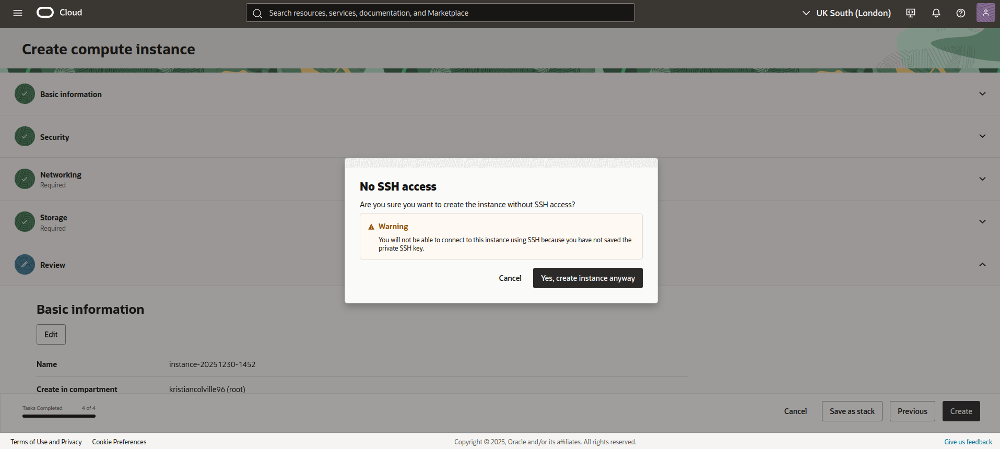
   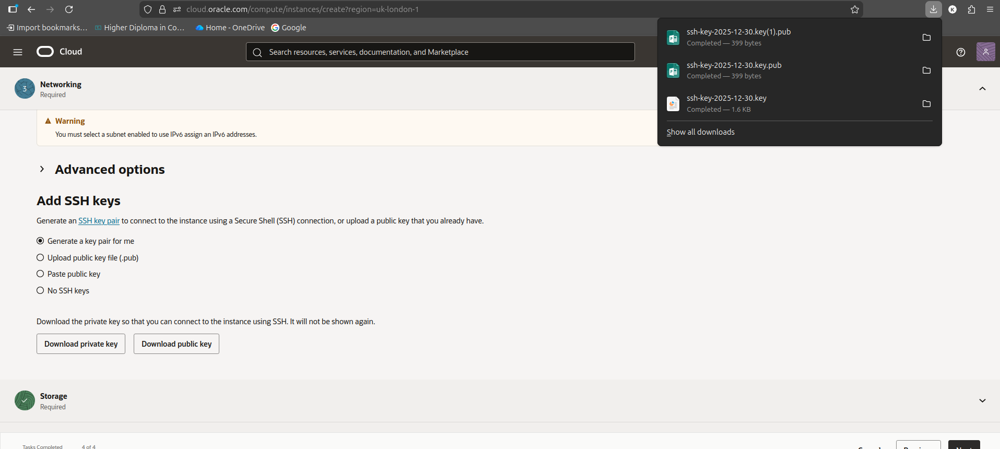
4. **Instance Details**

   - Instance created successfully
   - Obtained FQDN (Fully Qualified Domain Name) for the instance

   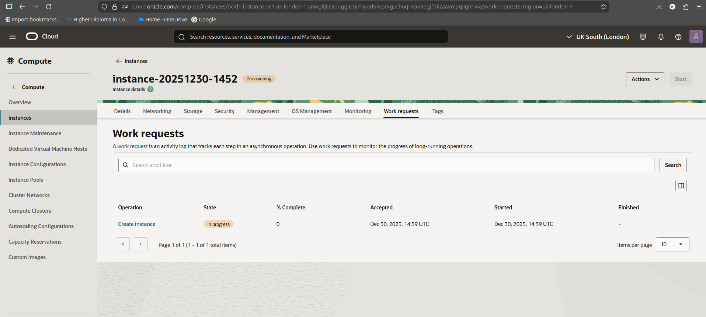
   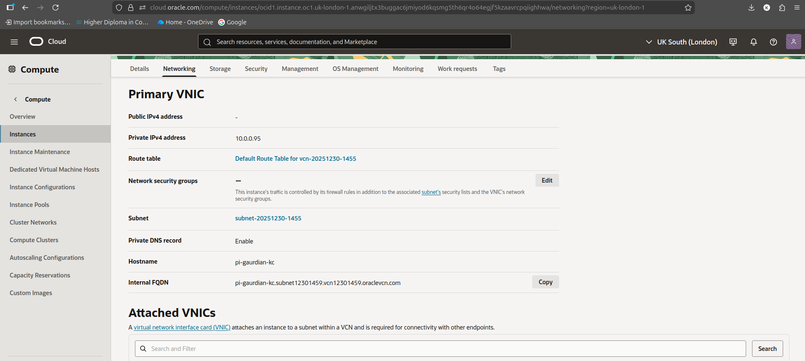
5. **Network Configuration**

   - Configured local SSH keys for connection
   - Created and attached public IP address to VNIC (Virtual Network Interface Card)
   - Created reserved IP first, then attached to VNIC for public access

   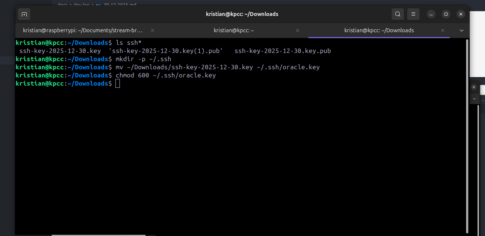
   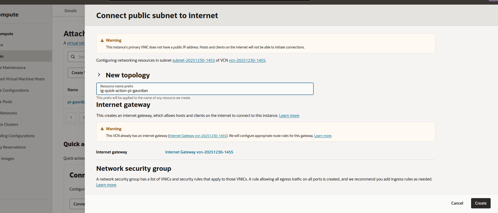
   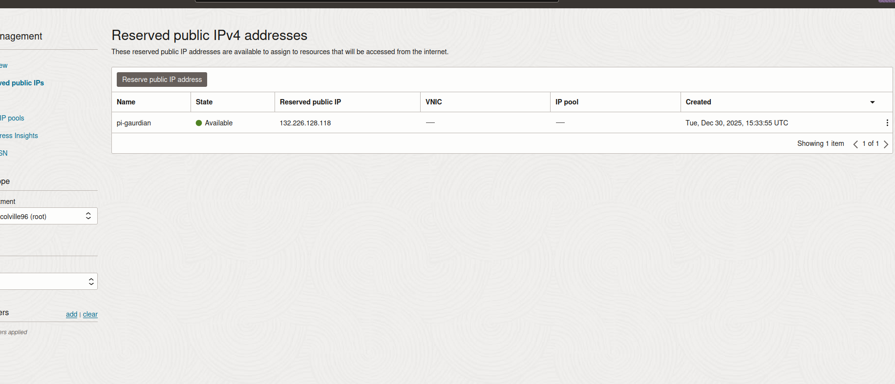
   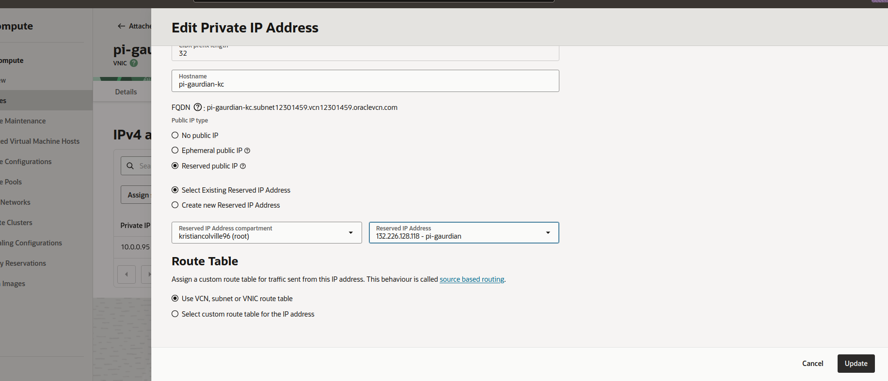
6. **SSH Connection Verification**

   - Successfully tested SSH connection using private key
   - Confirmed remote access to the server

   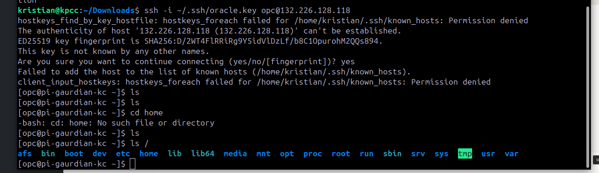

**Configuration Notes:**

- Initially tested with Oracle Linux, but performance was too slow
- Switched to Ubuntu 22.04 LTS for better performance and familiarity
- Changed from shared compute to dedicated VPS for improved speed
- After confirming SSH access, the initial instance was deleted and recreated with Ubuntu on dedicated VPS
- The server now runs Ubuntu on a dedicated VPS instance on Oracle Cloud free tier

### Service Deployment

#### MediaMTX (Video Streaming Server)

- **Installation**: Downloaded and configured MediaMTX binary
- **Service**: systemd service for automatic management
- **Configuration**: `/etc/mediamtx/mediamtx.yml`
- **Ports**: 8554 (RTSP), 8889 (WebRTC)
- **Status**: Enabled and running

#### Mosquitto (MQTT Broker)

- **Installation**: `sudo apt install mosquitto mosquitto-clients`
- **Service**: systemd service (`mosquitto.service`)
- **Configuration**: `/etc/mosquitto/mosquitto.conf`
- **Ports**: 1883 (standard MQTT), 9001 (WebSocket)
- **Status**: Enabled and running

**Mosquitto Configuration Highlights**:

```
listener 1883
protocol mqtt

listener 9001
protocol websockets
```

### MQTT Mosquitto Setup

MQTT Mosquitto is used as a publisher/subscriber system on the server so the Raspberry Pi can send events to it.

**Installation:**

```bash
sudo apt update
sudo apt install mosquitto mosquitto-clients
```

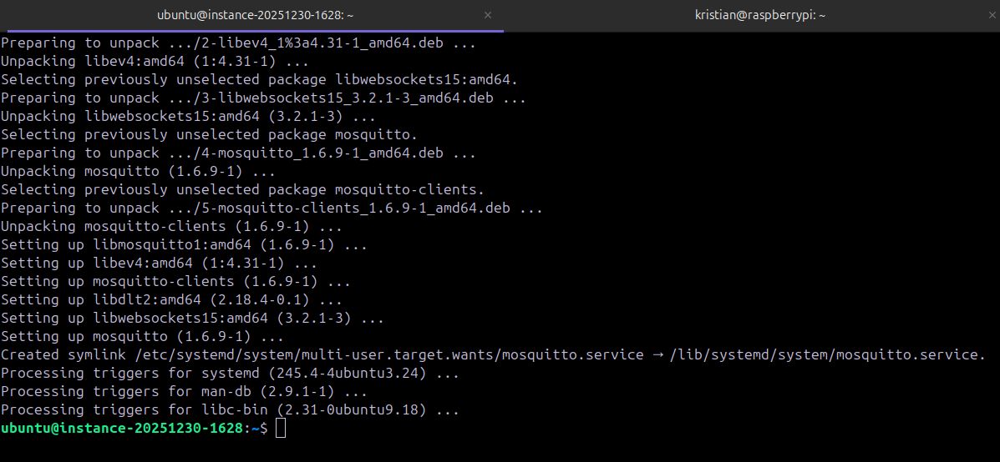

**Starting the Service:**

```bash
sudo systemctl enable mosquitto
sudo systemctl start mosquitto
```

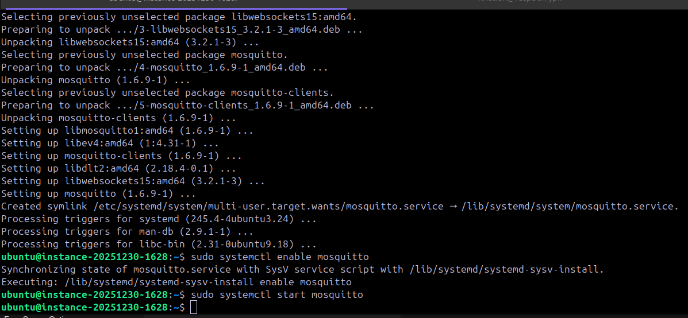

**Network Configuration:**

MQTT uses port 1883. Update the iptables and security list on the cloud server:

```bash
sudo iptables -A INPUT -p tcp --dport 1883 -j ACCEPT
```

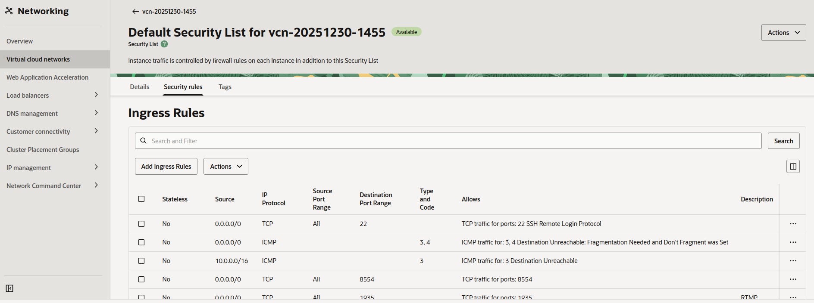

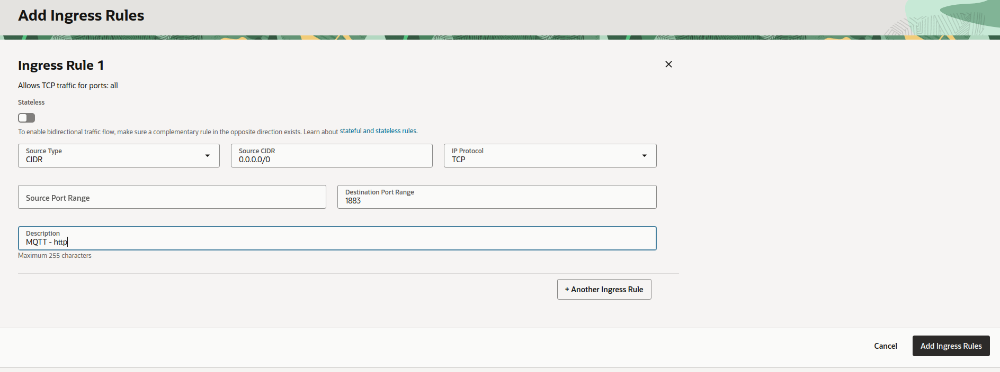

**Verify Service:**

Check that the port is listening:

```bash
ss -nltp
```

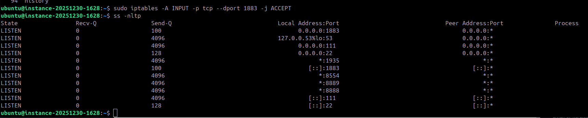

**Testing Basic Communication:**

Test the MQTT setup by subscribing on the Raspberry Pi or a local Linux machine:

```bash
mosquitto_sub -h your.server.ip -t test/topic
```

On the server, publish a test message:

```bash
mosquitto_pub -h your.server.ip -t test/topic -m "hello"
```

If ports need to be fixed, use a more specific iptables rule:

```bash
sudo iptables -I INPUT 5 -p tcp --dport 1883 -m conntrack --ctstate NEW -j ACCEPT
```


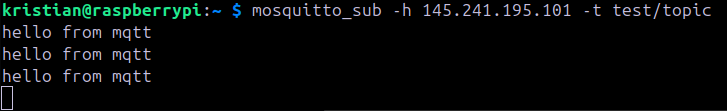

#### Backend API (Node.js/Express)

- **Location**: `/home/ubuntu/pi-guardian/backend/`
- **Framework**: Express.js with TypeORM
- **Database**: SQLite (development)
- **Service**: systemd service (`pi-guardian-backend.service`)
- **Port**: 3000 (internal, proxied through nginx)
- **Status**: Enabled and running

#### Frontend (React/Vite)

- **Location**: `/home/ubuntu/pi-guardian/frontend/dist/`
- **Framework**: React 19 with Vite
- **Build Output**: Static files served via nginx
- **Deployment**: Automated via GitHub Actions
- **Status**: Active deployment

#### Nginx (Reverse Proxy)

- **Installation**: `sudo apt install nginx`
- **Configuration**: `/etc/nginx/sites-available/pi-guardian`
- **SSL/TLS**: Let's Encrypt certificates via Certbot
- **Ports**: 80 (HTTP redirect), 443 (HTTPS)
- **Status**: Enabled and running

**Nginx Configuration:**

- Serves frontend static files from `/home/ubuntu/pi-guardian/frontend/dist`
- Proxies `/api/` requests to backend Node.js app (port 3000)
- Proxies `/cam/` requests to MediaMTX WebRTC server (port 8889)
- Proxies `/mqtt` WebSocket connections to Mosquitto (port 9001)
- Automatically redirects HTTP to HTTPS
- SSL certificates automatically renewed by Certbot

### Network Configuration

#### Oracle Cloud Network Security Groups (NSG)

- Configured ingress rules for required ports
- Configured egress rules for outbound traffic
- Security list rules for additional protection

#### Server Firewall (iptables)

- Rules configured and persisted in `/etc/iptables/rules.v4`
- Rules restored on system boot
- Connection state tracking enabled

#### Port Configuration

| Service        | Port | Protocol | Configuration Method               |
| -------------- | ---- | -------- | ---------------------------------- |
| HTTP           | 80   | TCP      | iptables + NSG (redirect to HTTPS) |
| HTTPS          | 443  | TCP      | iptables + NSG                     |
| RTSP           | 8554 | TCP      | iptables + NSG                     |
| WebRTC         | 8889 | TCP      | NSG                                |
| MQTT           | 1883 | TCP      | iptables + NSG                     |
| MQTT WebSocket | 9001 | TCP      | iptables + NSG                     |
| SSH            | 22   | TCP      | NSG (default)                      |

### CI/CD Pipeline (GitHub Actions)

Frontend deployment is automated using GitHub Actions CI/CD workflows. When changes are pushed to the `frontend/dist/` directory, the workflow automatically deploys the updated files to the server.

**Workflow File:** `.github/workflows/frontend-dist.yml`

**Workflow Process:**

1. **Trigger**: Automatic trigger on push to `frontend/dist/**` path
2. **Checkout**: Repository code checked out in GitHub Actions runner
3. **SSH Setup**: SSH private key configured from GitHub secret `SERVER_SSH_KEY`
4. **Clean Deployment**:
   - Removes existing remote dist folder completely
   - Creates fresh directory structure
   - Uses rsync with `--delete` flag for 1:1 file synchronization (no remnants)
5. **Deploy**: Copies local `frontend/dist/` to `/home/ubuntu/pi-guardian/frontend/dist/` on server
6. **Reload**: Reloads nginx service to serve updated files

**Configuration Requirements:**

- GitHub secret `SERVER_SSH_KEY`: Private SSH key for server authentication
- SSH user: `ubuntu`
- Server hostname: `pi-guardian.kcolville.com`
- Target directory: `/home/ubuntu/pi-guardian/frontend/dist/`

**Benefits:**

- Zero-downtime deployments (rsync atomic updates)
- Clean deployments (no leftover files)
- Automated nginx reload
- Version control integration
- No manual file copying required

### Manual Deployment Process

For initial setup or manual deployments:

1. Provision Oracle Cloud instance
2. Configure network security groups
3. Install and configure MediaMTX
4. Install and configure Mosquitto
5. Install and configure Nginx
6. Configure SSL/TLS with Certbot
7. Configure firewall rules (iptables)
8. Deploy backend application
9. Deploy frontend files (or use GitHub Actions)
10. Configure and enable systemd services
11. Test connectivity and functionality

## Deployment Diagram

*[Placeholder for deployment diagram showing: Infrastructure components, service locations, network connections, configuration files]*

## Deployment Checklist

### Raspberry Pi

- [X] Operating system installed
- [X] Camera module configured
- [X] Sense HAT configured
- [X] Python dependencies installed
- [X] Services configured (systemd)
- [X] Network connectivity verified
- [X] Services tested and running

### Cloud Server

- [X] Oracle Cloud instance provisioned
- [X] Network security groups configured
- [X] MediaMTX installed and configured
- [X] Mosquitto installed and configured
- [X] Nginx installed and configured
- [X] SSL/TLS certificates configured (Certbot)
- [X] Firewall rules configured (iptables)
- [X] Backend service deployed and running
- [X] Frontend deployed (manual or via GitHub Actions)
- [X] GitHub Actions CI/CD workflow configured
- [X] Services enabled and running
- [X] Port accessibility verified

## Service Management

### systemd Service Management

All services use systemd for process management:

```bash
# Enable service to start on boot
sudo systemctl enable service-name

# Start service
sudo systemctl start service-name

# Check service status
sudo systemctl status service-name

# View service logs
sudo journalctl -u service-name -f
```

### Service Dependencies

- Services are designed to be independent
- No explicit dependencies configured (rely on network availability)
- Services include internal retry logic for resilience

## Nginx Configuration Details

### Installation

```bash
sudo apt update
sudo apt install nginx -y
```

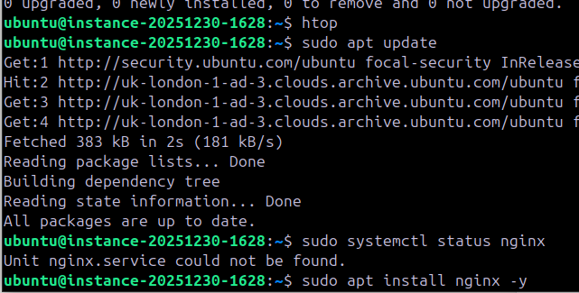

### Initial Configuration

1. **Copy Frontend and Backend Files**

   Ensure the frontend build (`dist` folder) and backend code are on the server:

   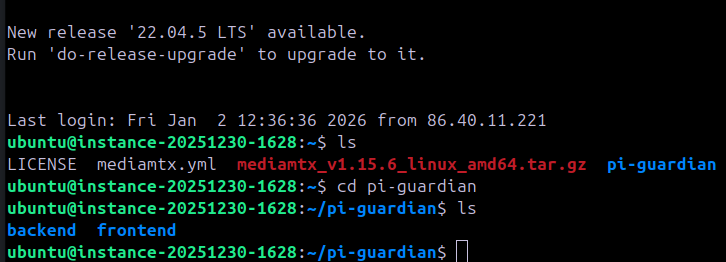
2. **Create Nginx Configuration**

   Navigate to the sites-available directory and create a configuration file:

   ```bash
   cd /etc/nginx/sites-available
   sudo nano pi-guardian
   ```

   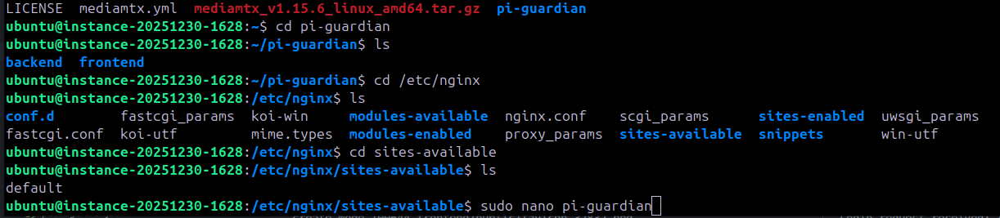
3. **Open Required Ports**

   Configure Oracle Cloud security list to allow HTTP (port 80) and HTTPS (port 443):

   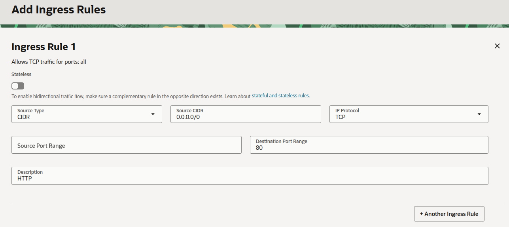

   Configure iptables on the server:

   ```bash
   sudo iptables -A INPUT -p tcp --dport 80 -j ACCEPT
   sudo iptables -A INPUT -p tcp --dport 443 -j ACCEPT
   ```

   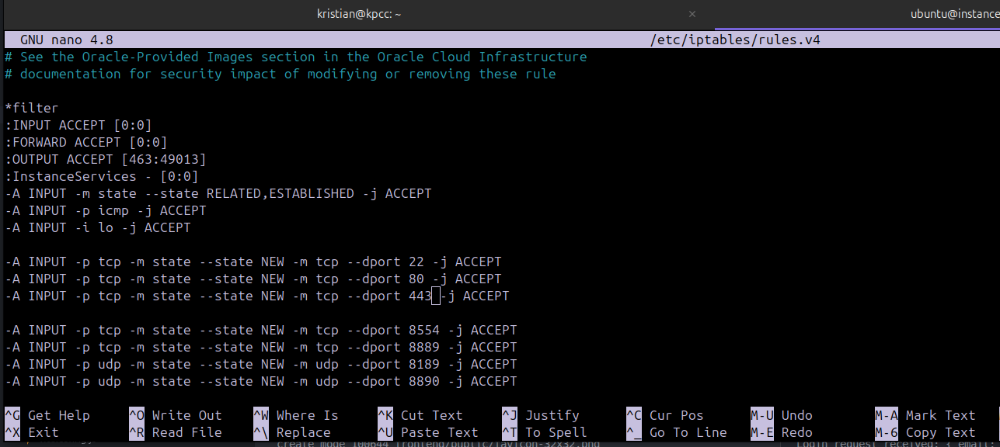
4. **Basic HTTP Configuration**

   Initial nginx configuration for serving frontend and proxying backend:

   ```nginx
   server {
       listen 80;
       server_name pi-guardian.kcolville.com;

       root /home/ubuntu/pi-guardian/frontend/dist;
       index index.html;

       location / {
           try_files $uri /index.html;
       }

       location /api/ {
           proxy_pass http://localhost:3000;
           proxy_http_version 1.1;
           proxy_set_header Upgrade $http_upgrade;
           proxy_set_header Connection 'upgrade';
           proxy_set_header Host $host;
           proxy_cache_bypass $http_upgrade;
       }
   }
   ```

   Test the configuration and enable the site:

   ```bash
   sudo nginx -t
   sudo ln -s /etc/nginx/sites-available/pi-guardian /etc/nginx/sites-enabled/
   sudo systemctl restart nginx
   ```

   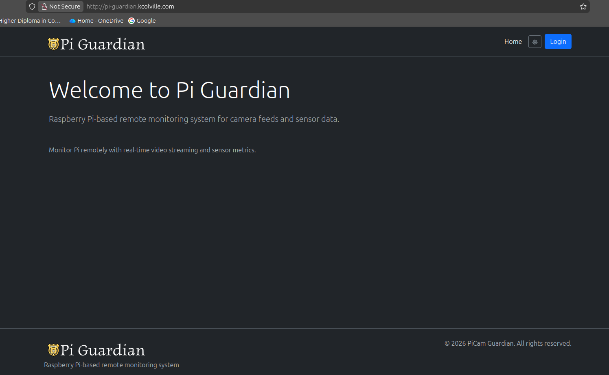

### SSL/TLS Configuration with Certbot

1. **Install Certbot**

   ```bash
   sudo apt install certbot python3-certbot-nginx -y
   ```
2. **Obtain SSL Certificate**

   Run Certbot to automatically configure SSL for your domain:

   ```bash
   sudo certbot --nginx -d pi-guardian.kcolville.com
   ```

   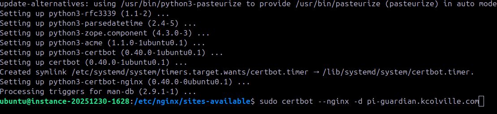

   Select option 2 to redirect HTTP traffic to HTTPS automatically:

   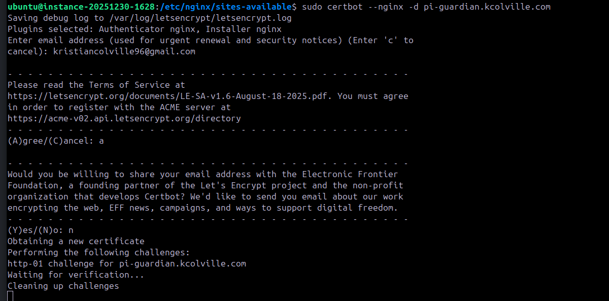
3. **Verify SSL Configuration**

   Certbot automatically updates your nginx configuration. Verify the changes:

   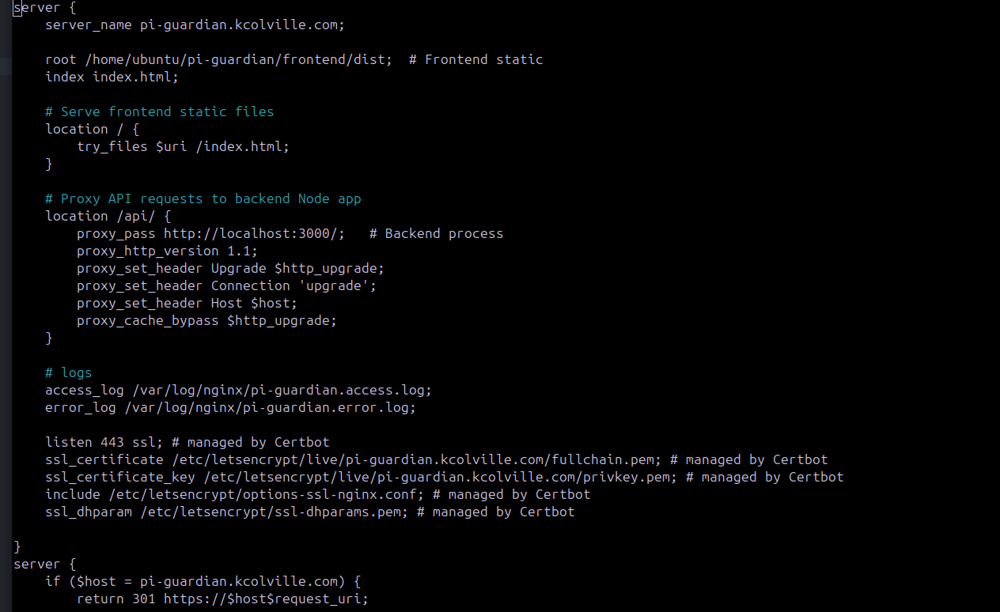

### Common Issues & Solutions

1. **Port Configuration Error**

   Ensure port 443 (not 433) is opened in the Oracle Cloud security list:

   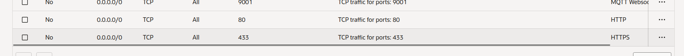
2. **HTTPS Working**

   After fixing port configuration, the site should load over HTTPS:

   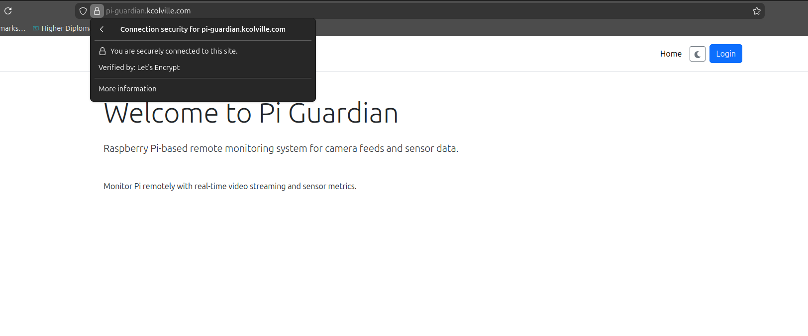
3. **WebSocket Proxy Configuration**

   For MQTT WebSocket connections, ensure proper upgrade headers:

   ```nginx
   location /mqtt {
       proxy_pass http://127.0.0.1:9001;
       proxy_http_version 1.1;
       proxy_set_header Upgrade $http_upgrade;
       proxy_set_header Connection "Upgrade";
       proxy_set_header Host $host;
       proxy_set_header X-Real-IP $remote_addr;
       proxy_set_header X-Forwarded-For $proxy_add_x_forwarded_for;
       proxy_set_header X-Forwarded-Proto $scheme;
   }
   ```

**Configuration Notes:**

- Certbot automatically manages SSL certificate renewal
- The configuration file is updated to include SSL settings and HTTP to HTTPS redirect
- All traffic is automatically redirected to HTTPS for security
- WebSocket connections require proper upgrade headers for WSS (WebSocket Secure) to work correctly

### Nginx Configuration Structure

The nginx configuration (`/etc/nginx/sites-available/pi-guardian`) includes:

1. **Frontend Static Files** (`location /`)

   - Serves React build files from `/home/ubuntu/pi-guardian/frontend/dist`
   - Single-page application routing with `try_files`
2. **Backend API Proxy** (`location /api/`)

   - Proxies to `http://localhost:3000`
   - WebSocket upgrade headers for real-time features
3. **Camera Stream Proxy** (`location /cam/`)

   - Proxies to MediaMTX WebRTC server (port 8889)
   - WebSocket upgrade headers for video streaming
4. **MQTT WebSocket Proxy** (`location /mqtt`)

   - Proxies to Mosquitto WebSocket listener (port 9001)
   - Proper WebSocket upgrade headers for WSS connections

### Firewall Configuration

Iptables rules are configured and persisted:

```bash
# Save current rules
sudo iptables-save > /etc/iptables/rules.v4

# Restore on boot (add to systemd service or /etc/rc.local)
sudo iptables-restore < /etc/iptables/rules.v4
```

## Deployment Notes

- Current deployment is suitable for development and production use
- SSL/TLS encryption enabled for all traffic
- Automated frontend deployment via GitHub Actions
- Domain: pi-guardian.kcolville.com
- DNS: Managed via Cloudflare

---

**Navigation**

[← Previous Section](security.md) | [Table of Contents](index.md) | [Next Section →](../README.md)

---

**PiCam Guardian** | [Repository](https://github.com/KristianColville1/pi-cam-gaurdian)
