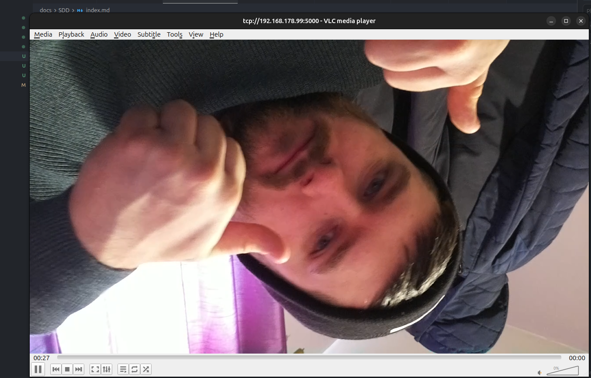

# System Design Document

**PiCam Guardian - System Architecture & Design**

This document outlines the system architecture, component design, and technical specifications for the PiCam Guardian IoT monitoring system.

---

## Table of Contents

- [Architecture Overview](SDD/architecture.md)
- [System Components](SDD/components.md)
- [Network Architecture](SDD/network.md)
- [Data Flow](SDD/data-flow.md)
- [API Design](SDD/api-design.md)
- [Security](SDD/security.md)
- [Deployment Architecture](SDD/deployment.md)

install/upgrade tools for video streaming on the pi:
sudo apt install -y libcamera-apps
sudo apt install -y ffmpeg gstreamer1.0-tools gstreamer1.0-plugins-base gstreamer1.0-plugins-good

Install vlc on the machine using ssh and run from terminal to broadcast:
rpicam-vid --width 1280 --height 720 --framerate 30 --inline --timeout 0 -o - |
ffmpeg -f h264 -i - -c copy -f mpegts tcp://0.0.0.0:5000?listen=1

open as network stream on vlc

test low latency near instant version by modifying the ffmpeg parameters for no buffering and low delay (500ms or less ideally).
Getting a 6 second delay so testing alternative.

rpicam-vid
  --width 1280 --height 720
  --framerate 30
  --inline
  --timeout 0
  -o - | ffmpeg
  -f h264 -i -
  -c copy
  -fflags nobuffer
  -flags low_delay
  -f mpegts tcp://0.0.0.0:5000?listen=1

---

**Navigation**

[← Previous Section]() | [Table of Contents](../README.md) | [Next Section →]()

---

**PiCam Guardian** | [Repository](https://github.com/KristianColville1/pi-cam-gaurdian)

<!-- Footer Component: README/footer.md -->
