setup publisher/subscriber system on the server so pie can send events to it.

sudo apt update
sudo apt install mosquitto mosquitto-clients

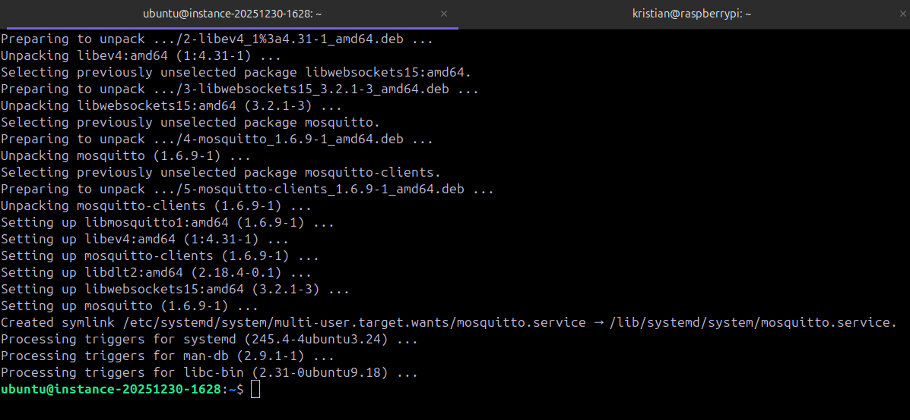

starting the service:

sudo systemctl enable mosquitto
sudo systemctl start mosquitto

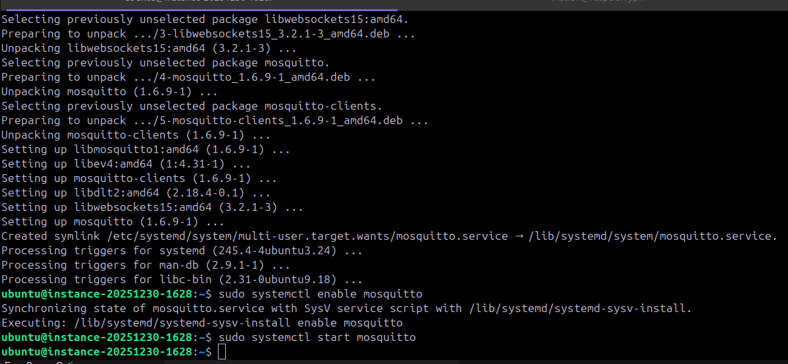

MQTT uses port 1883 on http

Open ports on server: update the ip table and security list on cloud.

sudo iptables -A INPUT -p tcp --dport 1883 -j ACCEPT

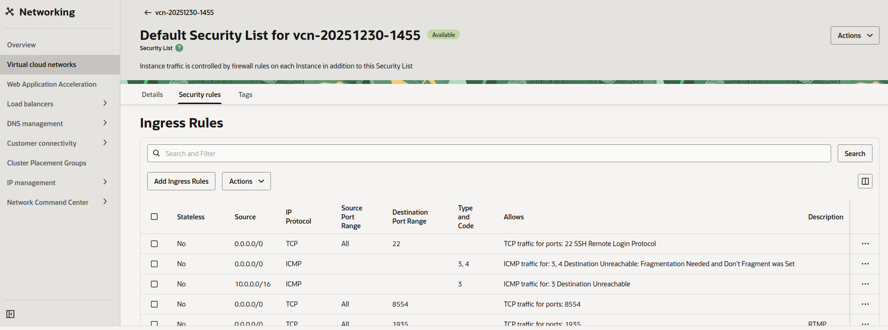

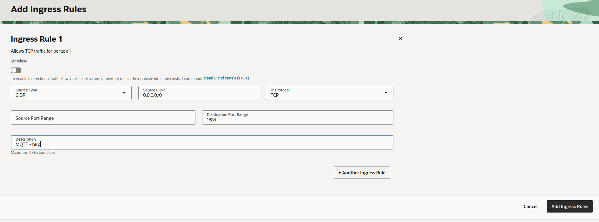

check ports listening: ss -nltp

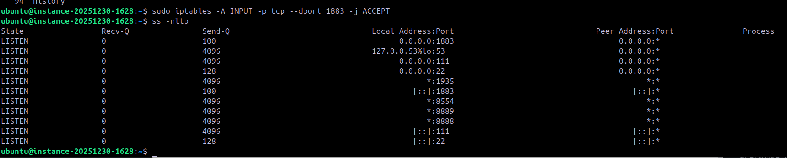

test basic communication

on the pi or a local linux machine:
mosquitto_sub -h your.server.ip -t test/topic

on the server:
mosquitto_pub -h your.server.ip -t test/topic -m "hello"
fix ports if necessary and save

i ran sudo iptables -I INPUT 5 -p tcp --dport 1883 -m conntrack --ctstate NEW -j ACCEPT

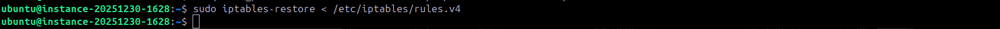
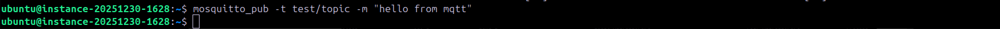

confirm on pi communication:

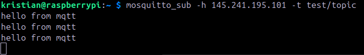

part 2:

need to setup a simple test by pushing some events from pie to our mqtt server expose websockets and transmit to frontend.
So full test of having frontend updates and the camera going all real time data.

opening port 9001 for mqtt websocket connection http upgrade

sudo iptables -I INPUT 5 -p tcp --dport 9001 -m conntrack --ctstate NEW -j ACCEPT
sudo iptables-restore < /etc/iptables/rules.v4
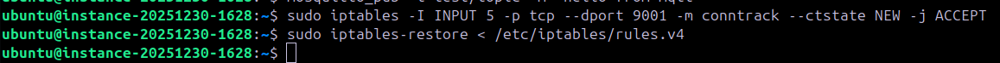

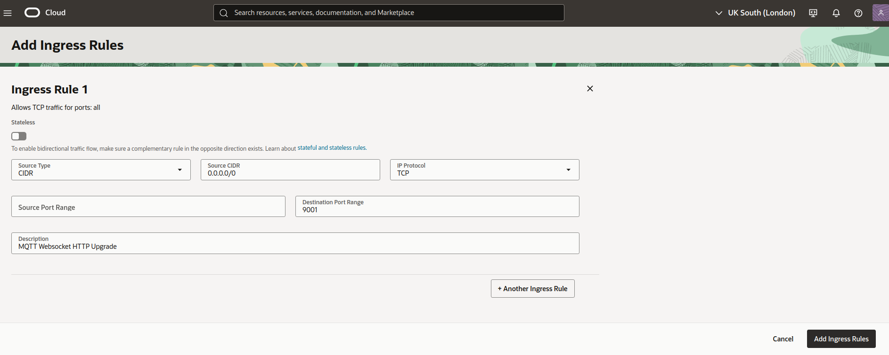

configure mosquitto to use websockets

sudo nano /etc/mosquitto/mosquitto.conf

added listener and protocol for the port and transmission method 1883 and 9001

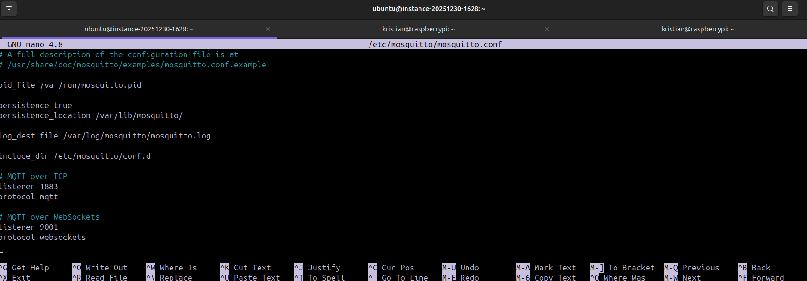

restarted mosquitto and checked it loaded:
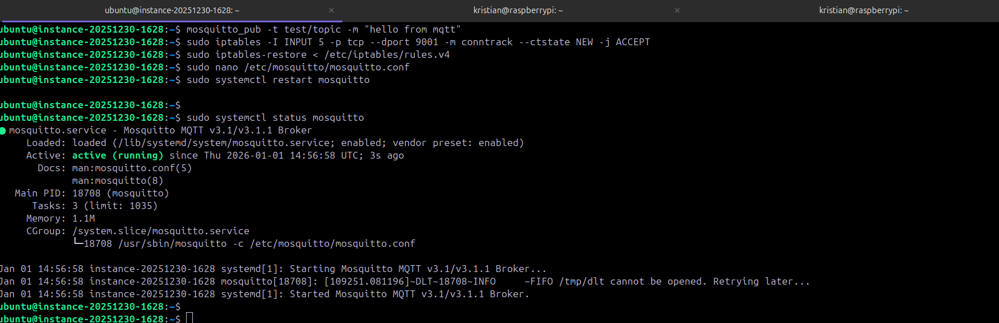

test connection to websocket port for mqtt:
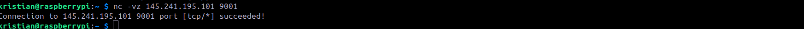

result:
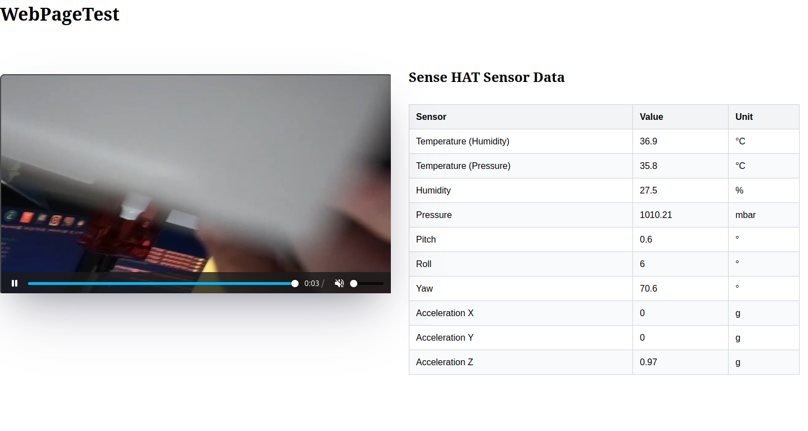

i added metrics.py to push events to mqtt for my table.

updated webpagetest.html to do websockets connection and dynamically update the table.

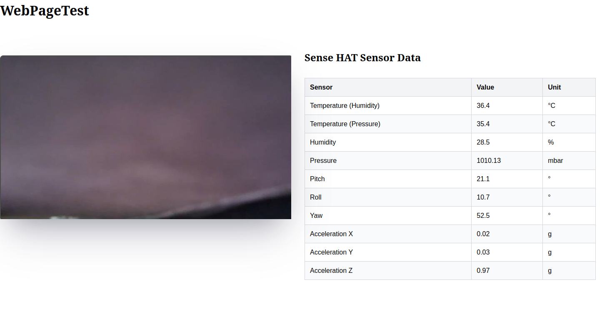

part 3: setting up nginx, frontend, backend and SSL

I purchased a cheap domain from cloudflare to use for the server:
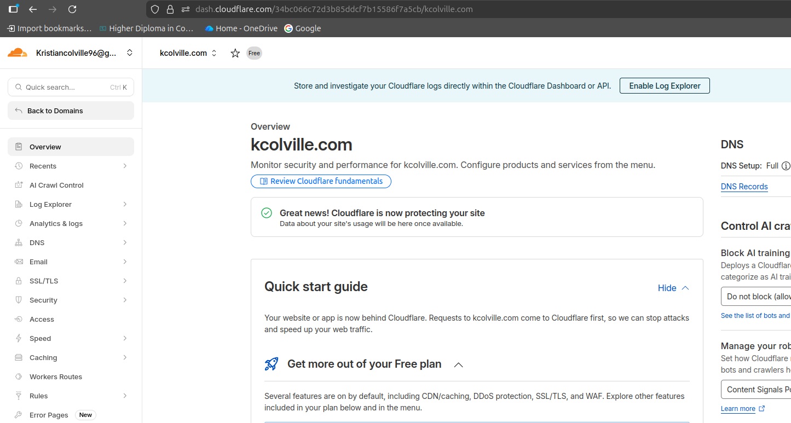

changed the server to use a reserved ip address

i had a reserved added earlier but not actually attached to this instance as i deleted the original instance:
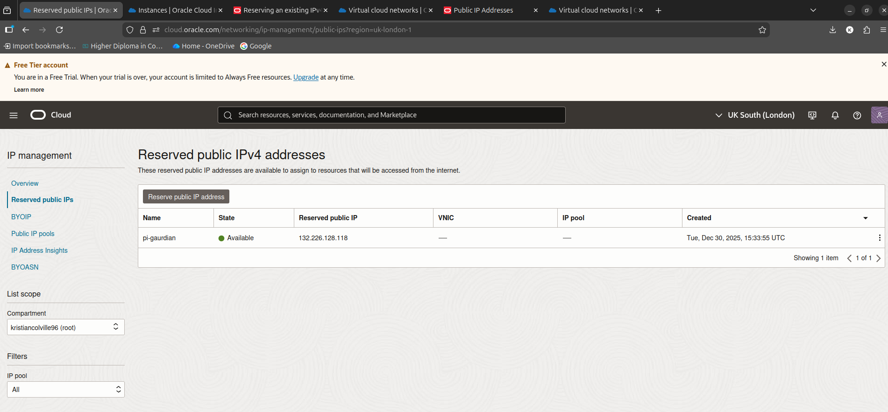

to reserve it i needed to remove the IP and then re add it as reserved and to my specific one:
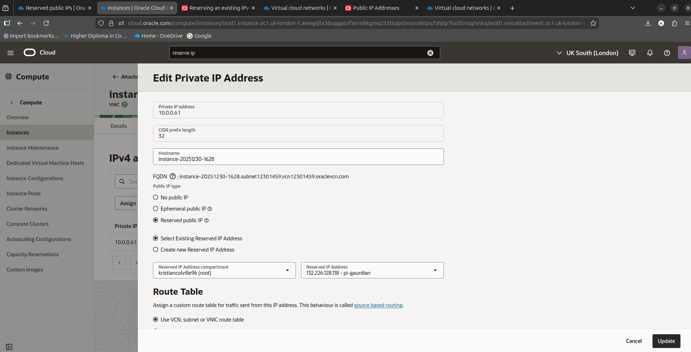

I've added the reserved ip to cloudflare and sub domain pi-gaurdian.kcolville.com:
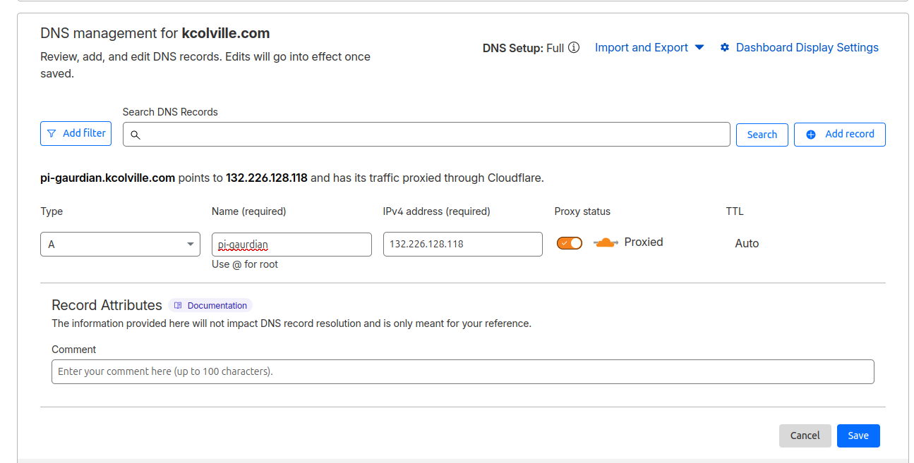
