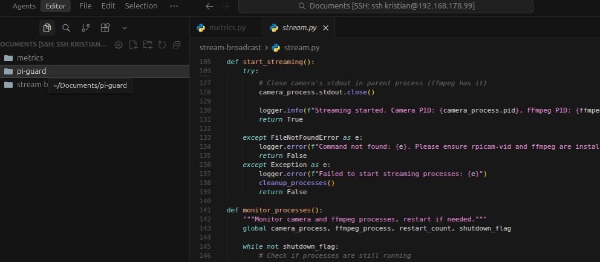

Upgrading the python metrics and stream system on the pi.
I'm having an issue with the stream working properly and constantly disconnecting.

Going to bring it up to production level today with a high level of reliability.
The idea being to bring it inline with the other parts of the architecture and easily extended.

I've created a new folder py-guard and this will be the new application on the pi handling the streaming and metrics and more.

I stopped both stream and metrics applications on the pi

creating a new virtual environment in the pie:

I deciced to move over to a new window and work directly using ssh tunnel in vscode on the pi. for ease of development:

