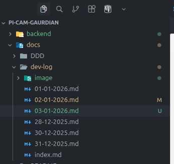
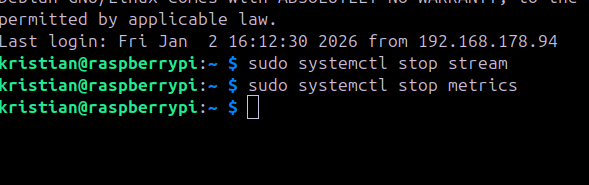
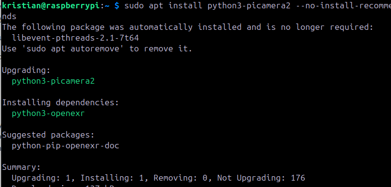
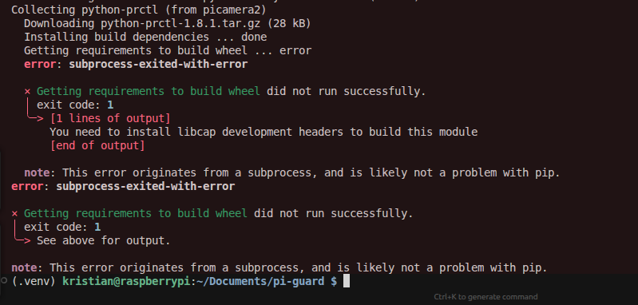
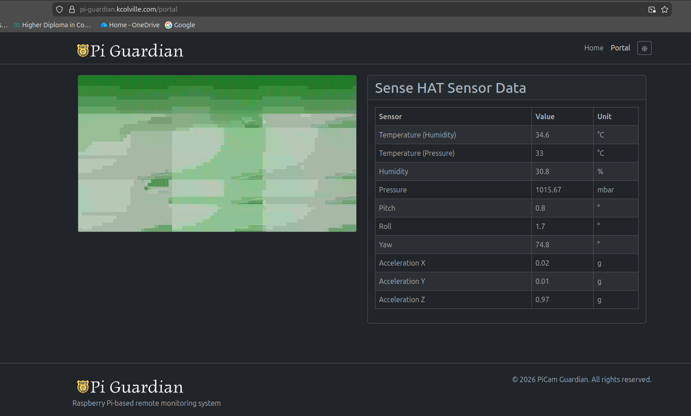
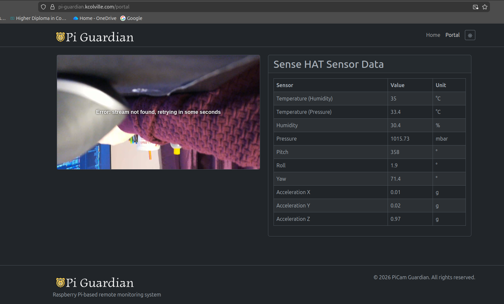

Upgrading the python metrics and stream system on the pi.
I'm having an issue with the stream working properly and constantly disconnecting.

Going to bring it up to production level today with a high level of reliability.
The idea being to bring it inline with the other parts of the architecture and easily extended.

I've created a new folder py-guard and this will be the new application on the pi handling the streaming and metrics and more.


I stopped both stream and metrics applications on the pi


creating a new virtual environment in the pie:


installed picamera2 on the pi:


getting errors on the pi:


installed the missing dependency on the ras pi:

libcap-dev

I noticed after I managed to get a stream going from the camera service.py file that the content being output was terrible:


I started this project initially using just a terminal command and trying to expand that up into two separate python processes stream & metrics. It was good but just didnt persist for me or allow me to do much else.

I've spent the entire day playing around with python and getting a unified app together that can also be further extended.
From course notes I found picamera2 and picamera and tested different configurations.

I had to install and remove packages from my pi and re add them etc. Nightmare.

I turned on allow system packages so that picamera2 would get working again.

Thats when I got the above image from testing and some tutorials on it and configuring it then for my implementation.
This was probably the best video i came across, mixed with a few others. Slightly outdated etc but manged from trial and error:
https://www.youtube.com/watch?v=NOAY1aaVPAw

One of the biggest issues was maintaining the stream over longer durations. 

I manged to get it to about here in the camera service.

```python
from picamera2 import Picamera2
from picamera2.encoders import H264Encoder
from picamera2.outputs import Output
import queue
from config import settings

class QueueOutput(Output):
    """Custom output class to capture H.264 encoded bytes in a queue."""
    def __init__(self, maxsize=10):
        super().__init__()
        self.queue = queue.Queue(maxsize=maxsize)
  
    def outputframe(self, frame, keyframe=True, timestamp=None, packet=None, audio=False):
        """Called by encoder to output a frame."""
        try:
            self.queue.put_nowait(frame)
        except queue.Full:
            # Drop oldest frame if queue is full
            try:
                self.queue.get_nowait()
                self.queue.put_nowait(frame)
            except queue.Empty:
                pass
  
    def get_frame(self, timeout=None):
        """Get the next encoded frame from the queue."""
        try:
            return self.queue.get(timeout=timeout)
        except queue.Empty:
            return None

class CameraService:
    def __init__(self):
        self.camera = None
        self._encoder = None
        self._encoder_output = None

    def start(self):
        if self.camera is None:
            self.camera = Picamera2()
            # Parse resolution
            width, height = settings.STREAM_RESOLUTION.split(':')
            size = (int(width), int(height))
        
            # Configure camera with video configuration
            video_config = self.camera.create_video_configuration(
                main={"size": size}
            )
            self.camera.configure(video_config)
        
            # Create H.264 encoder
            self._encoder_output = QueueOutput()
            self._encoder = H264Encoder(bitrate=settings.STREAM_BITRATE)
            self._encoder.output = self._encoder_output
        
            self.camera.start_encoder(self._encoder)
            self.camera.start()
        elif not self.camera.started:
            self.camera.start()

    def stop(self):
        if self.camera is not None:
            if self.camera.started:
                self.camera.stop()
            if self._encoder is not None:
                self.camera.stop_encoder(self._encoder)
                self._encoder = None
                self._encoder_output = None

    def get_camera(self):
        """Get the Picamera2 instance."""
        return self.camera

    def capture_frame(self):
        """Capture a frame from the camera."""
        if self.camera is None:
            raise RuntimeError("Camera not started. Call start() first.")
        return self.camera.capture_array()

    def get_encoder_output(self):
        """Get the encoder output queue for reading H.264 frames."""
        if self.camera is None or self._encoder_output is None:
            raise RuntimeError("Camera not started. Call start() first.")
        return self._encoder_output

```


I thought I was right good there just to get it back to doing continous stream but same issue again with random disconnect:


On better footing though and working on the pi, need to get proper feedback from ffmpeg and the camera to determine whats wrong.
I've ruled out the server because its actually reliable mediamtx.
