I left the camera running lastnight and had a continous live stream all night which is excellent:
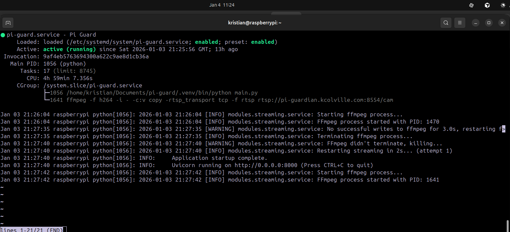

Before moving away from it temporarily, i confirmed that both old systemd services were actually disabled:
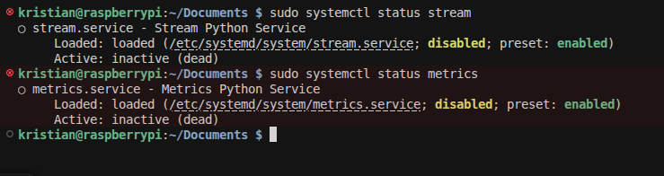

I want to be able to update the files on the server without manually copying them so i began setting up an actions file to automatically do it on commit for me to the repo.

In github I created a new secret SERVER_SSH_KEY and pasted in my private key I got earlier from oracle:
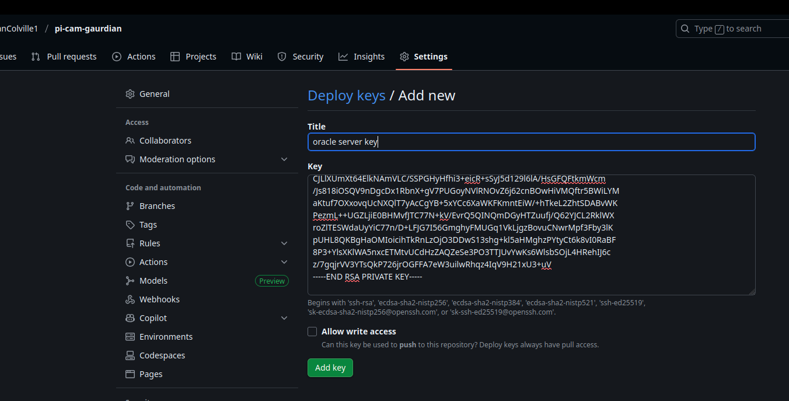

I started off testing simply removing the folder and adding it back from the repo:
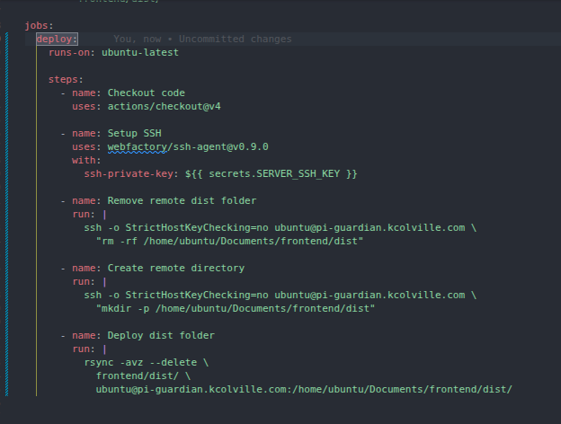

ran a new build on the frontend:
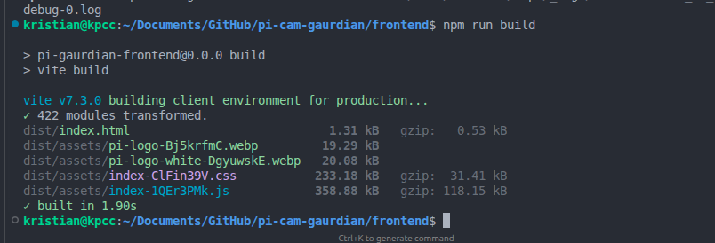

I noticed the dist folder was actually included in the .gitignore so i removed it completely.
Its fine for the moment small asset frontend:
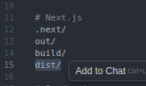

commit changes:
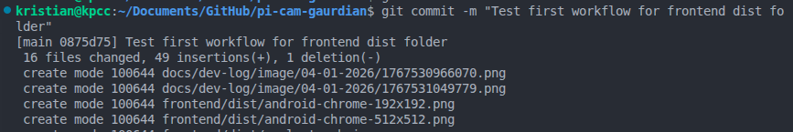

It popped up on github within 10 seconds on this page:
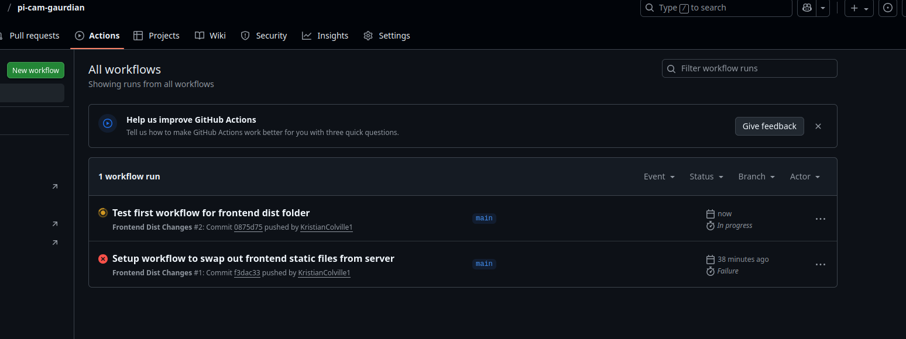

I went down through the logs to see if it worked properly as it didnt exit with an error.
I could see the ssh step worked:
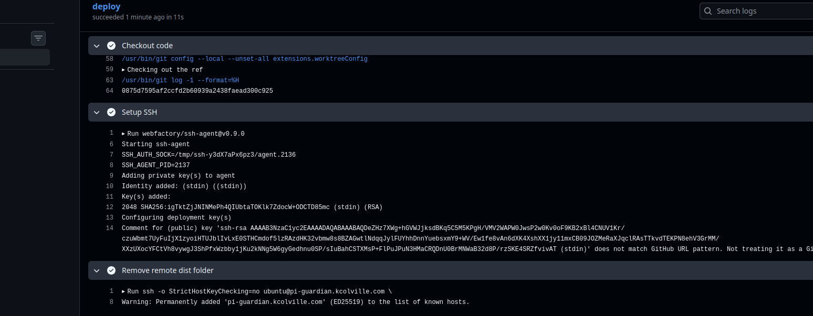

the rsync command worked as well:


It all worked perfectly on the first go of the actions which is great.
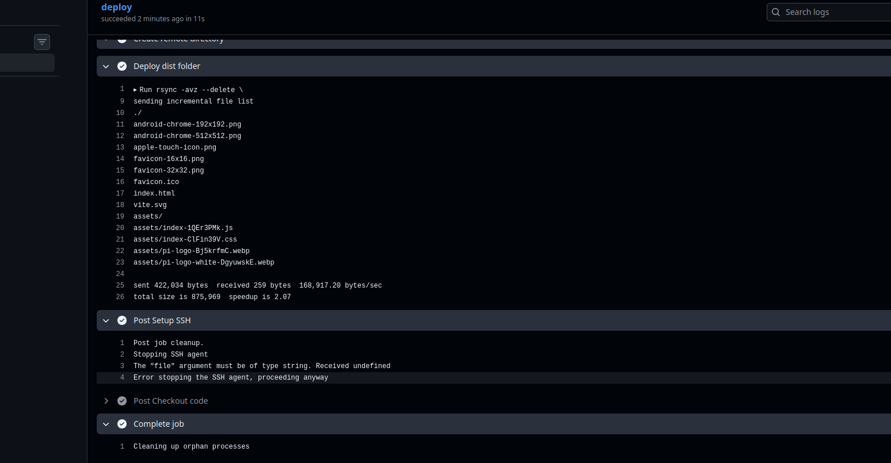

Moving onto figuring out how to reload nginx now.
I just added a simple ssh in and sudo systemctl restart nginx.
The ssh access private key requires no password due to my initial configuration.

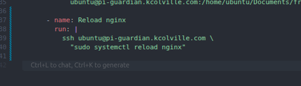

Created a new build in frontend and did a second commit test.

I didnt get any changes due to vite caching complexity so i made a change we could observe from frontend:
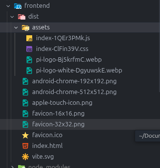

started the frontend and backend in dev mode:
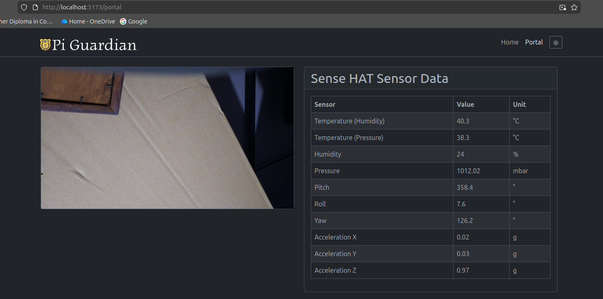

I made a small css change to the table and ran build again:
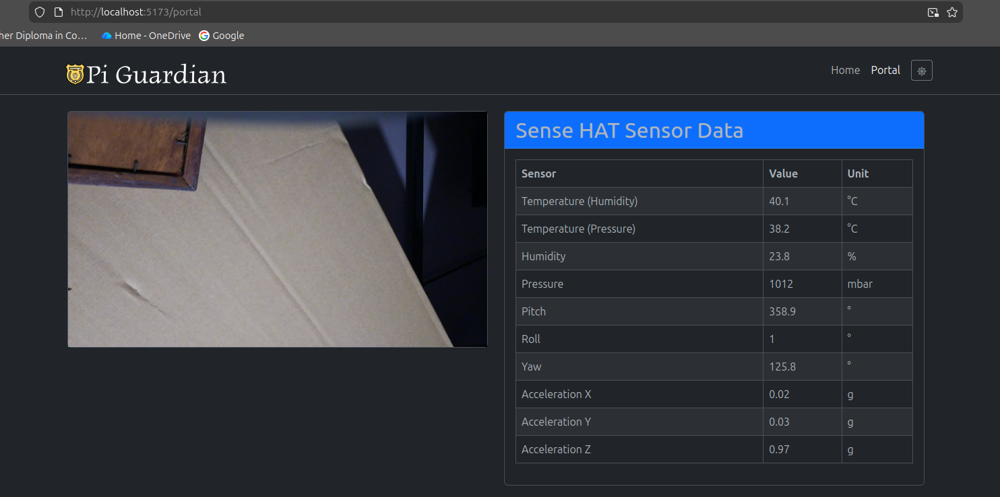

committed my changes and went to the actions panel again:
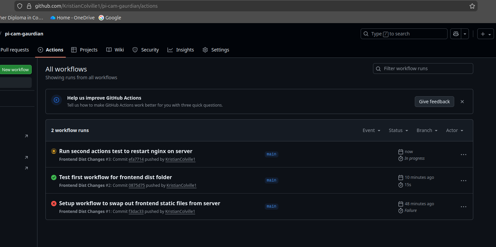

It appeared to work successfully:
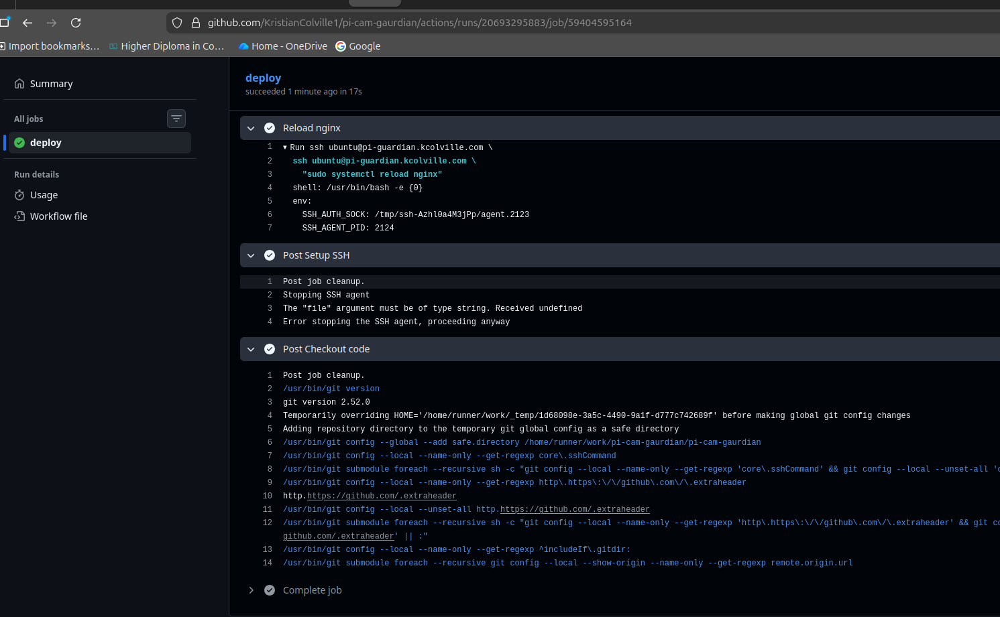

I reloaded the portal but saw no changes:
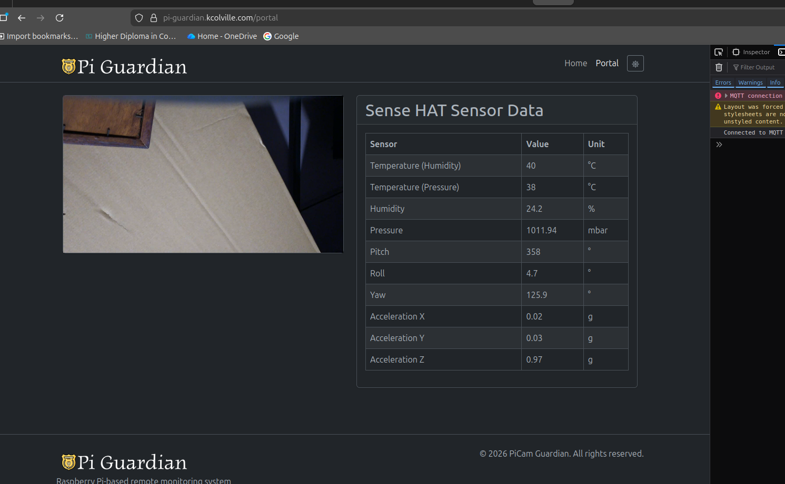

i set up a terminal session with the server and checked the status of nginx.
It did actually reload nginx so I was confused and suspected caching:

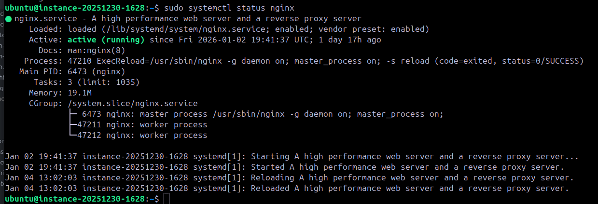

I confirmed the files were indeed the right ones matching the current state:
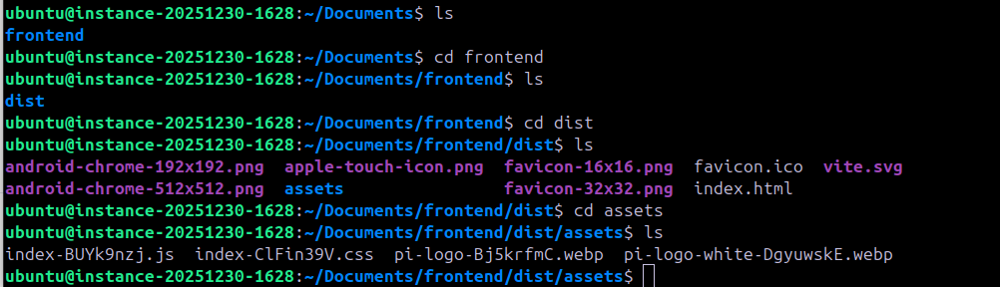

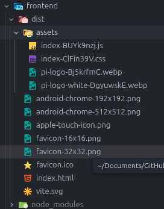

went over to the frontend to see what versions it was recieving. Immediately it caching issue was clear.
The files did not match what the frontend was getting:
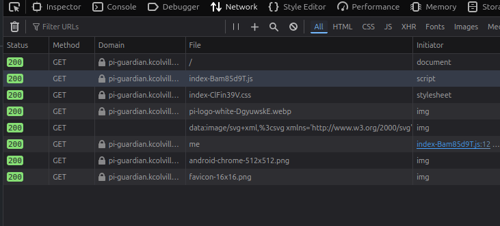

I went to cloudflare and decided to create a rule to disable caching with a bypass template:
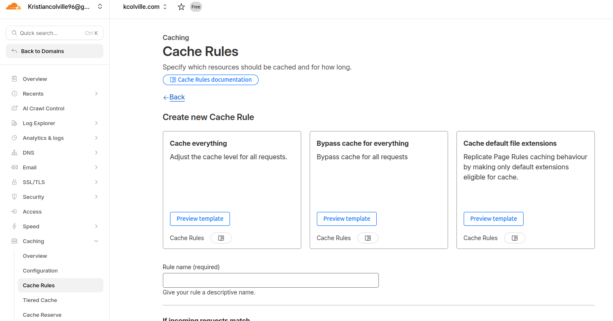

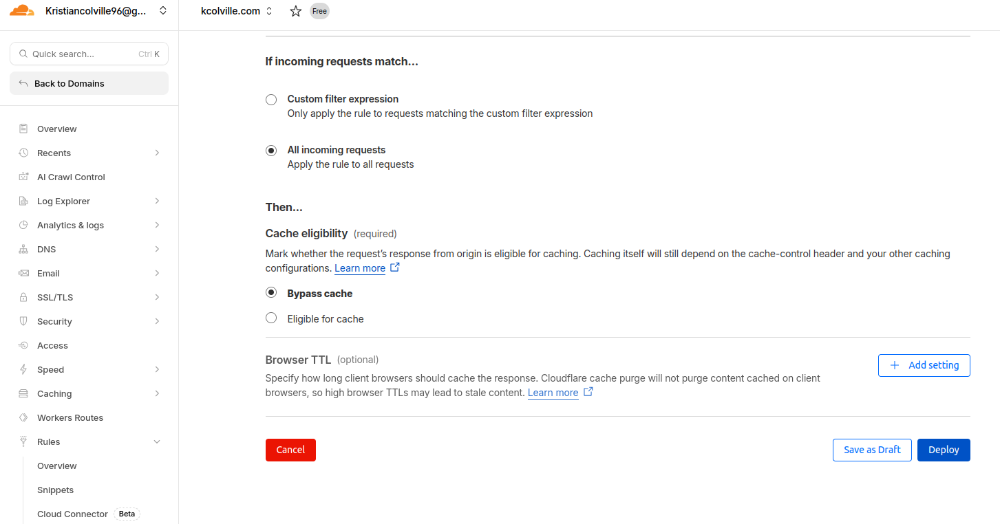

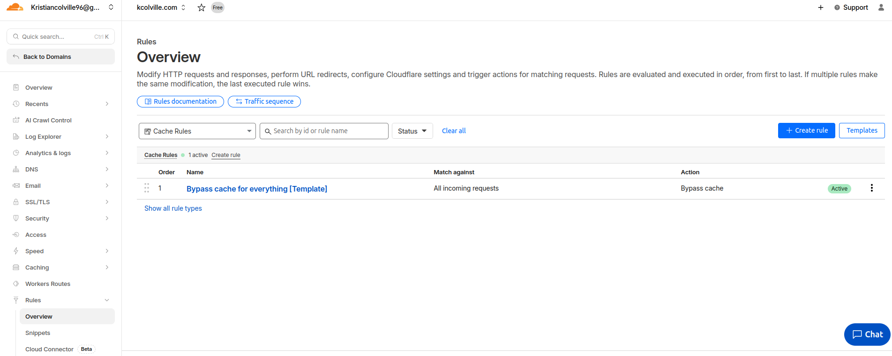


that still didnt work but no problem. I decided to examine where exactly the file was being retrieved from on the server.
I was so annoyed I realised I incorrectly setup the path for the actions thinking it was like my home directory.

I made some more changes, built again and commited:
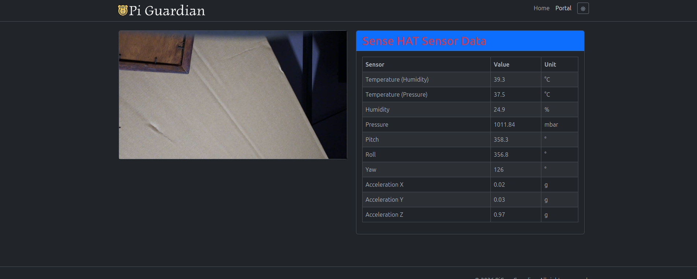

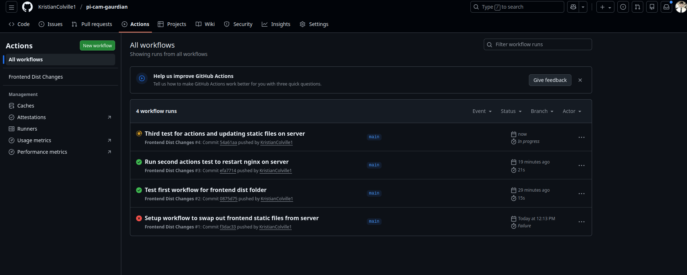

I reloaded the live website page and changes made took effect. Absolutely delighted.
Final configuration:


```yaml
name: Frontend Dist Changes

on:
  push:
    paths:
      - 'frontend/dist/**'

jobs:
  deploy:
    runs-on: ubuntu-latest
  
    steps:
      - name: Checkout code
        uses: actions/checkout@v4
  
      - name: Setup SSH
        uses: webfactory/ssh-agent@v0.9.0
        with:
          ssh-private-key: ${{ secrets.SERVER_SSH_KEY }}
  
      - name: Remove remote dist folder
        run: |
          ssh -o StrictHostKeyChecking=no ubuntu@pi-guardian.kcolville.com \
            "rm -rf /home/ubuntu/pi-guardian/frontend/dist"
  
      - name: Create remote directory
        run: |
          ssh -o StrictHostKeyChecking=no ubuntu@pi-guardian.kcolville.com \
            "mkdir -p /home/ubuntu/pi-guardian/frontend/dist"
  
      - name: Deploy dist folder
        run: |
          rsync -avz --delete \
            frontend/dist/ \
            ubuntu@pi-guardian.kcolville.com:/home/ubuntu/pi-guardian/frontend/dist/
  
      - name: Reload nginx
        run: |
          ssh ubuntu@pi-guardian.kcolville.com \
            "sudo systemctl reload nginx"


```

Frontend was easy enough so made duplicate and adapted for backend.

I moved the local and production databases up 1 level outside of backend:
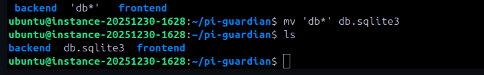

I began testing this version:


```yaml
name: Backend Changes

on:
  push:
    paths:
      - 'backend/**'

jobs:
  deploy:
    runs-on: ubuntu-latest
  
    steps:
      - name: Checkout code
        uses: actions/checkout@v4
  
      - name: Setup SSH
        uses: webfactory/ssh-agent@v0.9.0
        with:
          ssh-private-key: ${{ secrets.SERVER_SSH_KEY }}
  
      - name: Create remote directory if not exists
        run: |
          ssh -o StrictHostKeyChecking=no ubuntu@pi-guardian.kcolville.com \
            "mkdir -p /home/ubuntu/pi-guardian/backend"
  
      - name: Deploy backend folder
        run: |
          rsync -avz --delete \
            --exclude 'node_modules' \
            backend/ \
            ubuntu@pi-guardian.kcolville.com:/home/ubuntu/pi-guardian/backend/
  
      - name: Install dependencies and run init-db
        run: |
          ssh ubuntu@pi-guardian.kcolville.com \
            "cd /home/ubuntu/pi-guardian/backend && npm install && npm run init-db"
  
      - name: Restart backend service
        run: |
          ssh ubuntu@pi-guardian.kcolville.com \
            "sudo systemctl restart pi-guardian"
  
      - name: Reload nginx
        run: |
          ssh ubuntu@pi-guardian.kcolville.com \
            "sudo systemctl reload nginx"


```
