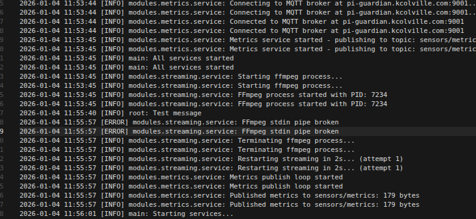
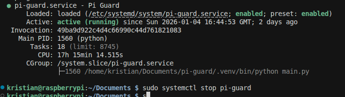
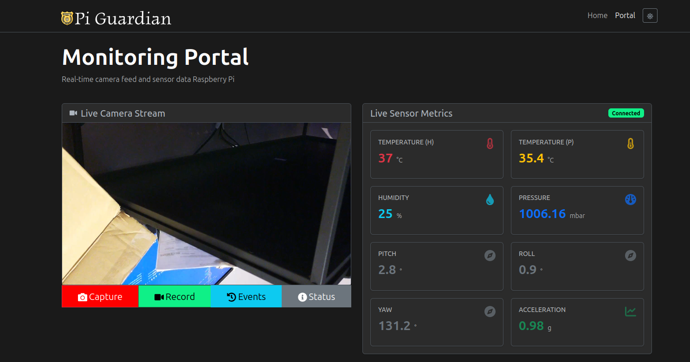
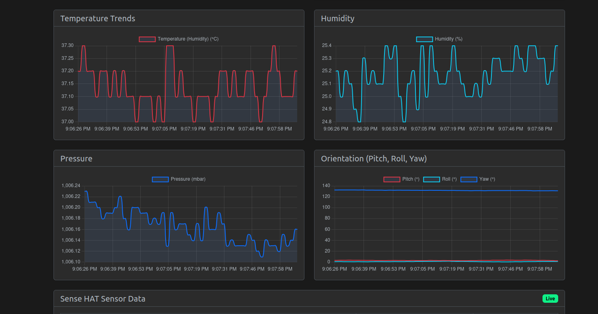
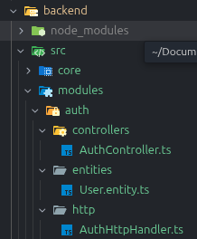
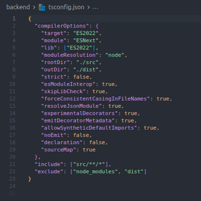
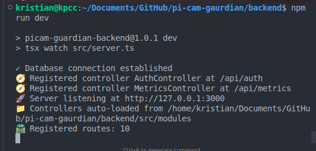
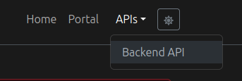
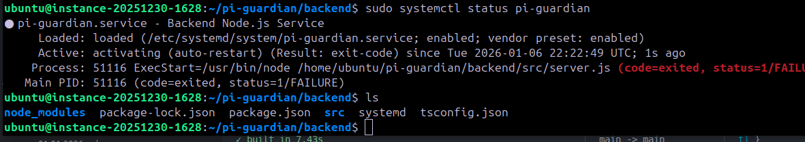
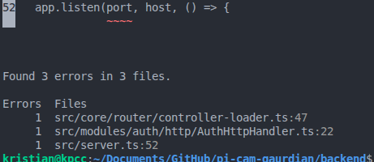

Checked pi-guard python system today and the mqtt messages were working but the camera was unreliable it didnt reconnect as expected. Through debug.log I found the ffmpeg pipe broke:

2026-01-04 11:55:57 [ERROR] modules.streaming.service: FFmpeg stdin pipe broken

2026-01-04 11:55:57 [ERROR] modules.streaming.service: FFmpeg stdin pipe broken



I stopped the service on the pi and started working on improving the error handling and retry mechanism in the service.


I desperately needed to refactor the stream loop in the service so i refactored out many methods as utilities for the ffmpeg processing and cleaned up the service to make it easier to read and fix further.

I brought it down further to a neat cleaner version:

```python
    async def _stream_loop(self):
        """Async loop for streaming video frames to ffmpeg."""
        restart_count = 0
  
        while self._running and not self._shutdown_event.is_set():
            try:
                if not self._validate_camera():
                    break
          
                if not await self._start_ffmpeg_stream():
                    break
          
                encoder_output = self.camera_service.get_encoder_output()
                health_monitor = StreamHealthMonitor()
                restart_count = 0
          
                await self._process_frames(encoder_output, health_monitor)
          
                self._cleanup_ffmpeg()
          
                if self._shutdown_event.is_set():
                    break
          
                restart_count += 1
                if not await self._wait_for_restart(restart_count):
                    break
      
            except asyncio.CancelledError:
                break
            except KeyboardInterrupt:
                logger.info("Received keyboard interrupt, shutting down...")
                break
            except Exception as e:
                logger.error(f"Unexpected error in stream loop: {e}", exc_info=True)
                self._cleanup_ffmpeg()
                await asyncio.sleep(1.0)
```

Moving on I returned to the frontend to take advantage of my CI/CD pipeline and move at pace to develop the experience I'm after and aiming for release 3 with signifiant updates to the database and python service.

I gave the portal a face lift and ready for new features:




started adding new database tables.

I got irritated trying to get decorators to work in javascript so decided to convert the project to typescript as the backend was minimal.
I gave up a few areas to it and decided to allow the 'any' type and to only add types where if i need/expect a specific structure then to implement them.

The genius in it is to not over type or over complicate the code base for something so small.

I'm used to writing code structurally so I wanted to have my controllers neat and tidy with route, handler etc all written together instead of separated up and down the files. Additionally, if not doing so just end up creating many unnecessary files and bloating the file architecture.

obviously deleting the node_modules folder before re-installing typescript specific package versions and types:


I made the project tsconfig not scrict and loosend it up a good bit.


No obvious issues after running.


I added an openapi system at the start hoping to get the chance to actually implement it properly:


everytime the backend is booted it builds the openapi spec.

create new option, context etc for openapi using swagger to render data:


backend went down after swapping to typescript with no build version of the backend.


few errors running build, went and fixed those.no types.



confirmed building works.
