Goals today is to look into the pi manual for picamera2 in more depth for my release 3.

Basically want to carefully separate the stream into multiple channels with minimal overhead to the pi.

have a main stream for snapshots and recordings and link back more functionality to the pi guardian website.

Have the live stream maintain about 220ms latency for myself and working stable on the website.

Inform the backend of processing changes etc or new footage, pictures etc. upload the material to a sharing platform the website can use through a content delivery network.

https://pip-assets.raspberrypi.com/categories/652-raspberry-pi-camera-module-2/documents/RP-008156-DS-2-picamera2-manual.pdf?disposition=inline

improving feature set and frontend appearance:

I discovered an convenient little issue in the pi-guardian python app. The metrics stalled sending and it caused the camera to stall.
I suspect that its related as I was observing the page at the time and not coincidental.

Implementing some non blocking asynchronous logic to wrap the app in.

I sorted that and still monitoring.

I set up account with bunny.net for cdn, need somewhere to put images and recordings. setup a small budget of 24.
Min cost is 1 per month in USD.

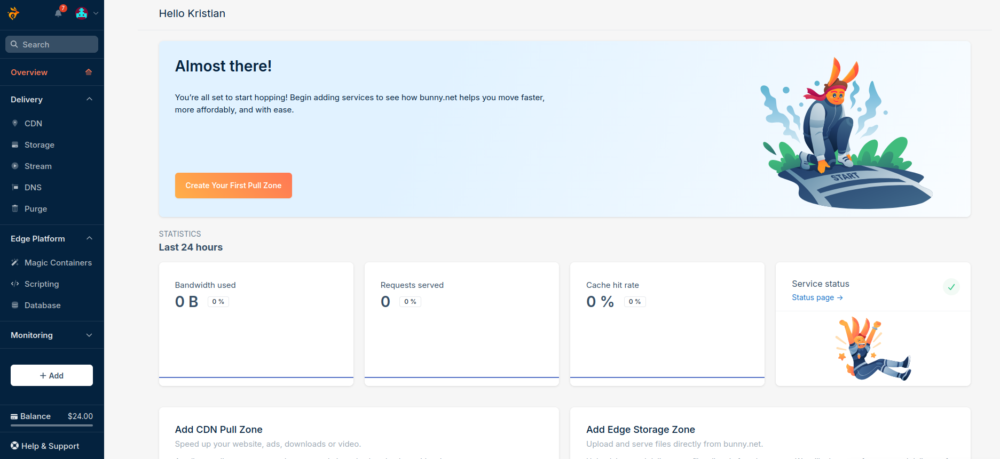

setup new storage zone pi-guardian:

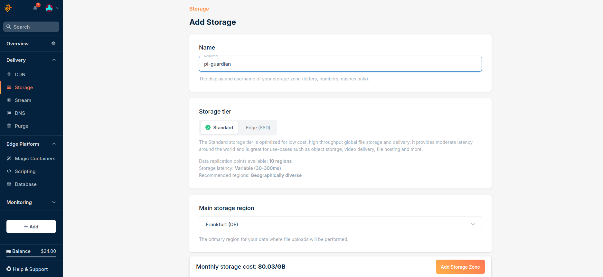

kept just 1 replication zone:
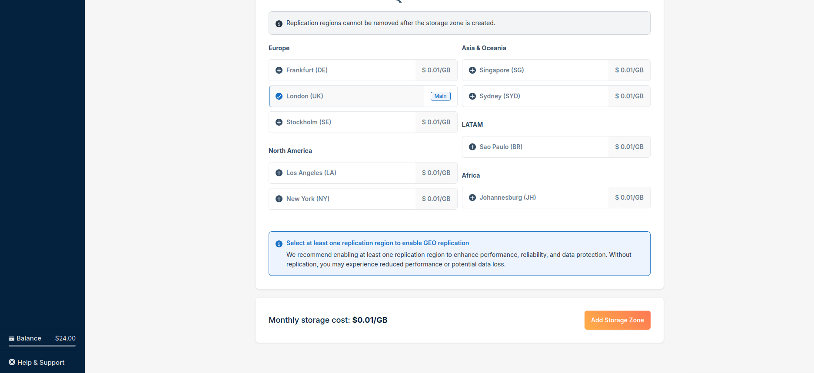

created a pull zone to access the bucket:
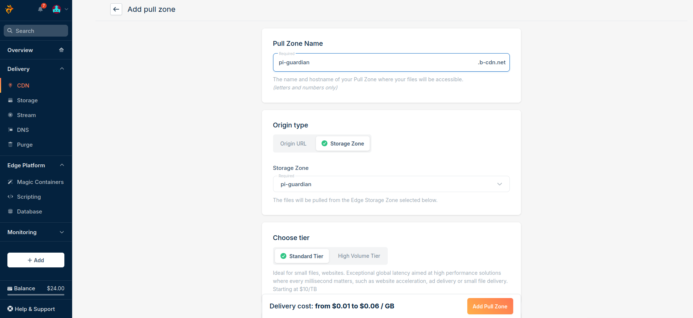

set my pricing zone to europe to keep cheap:
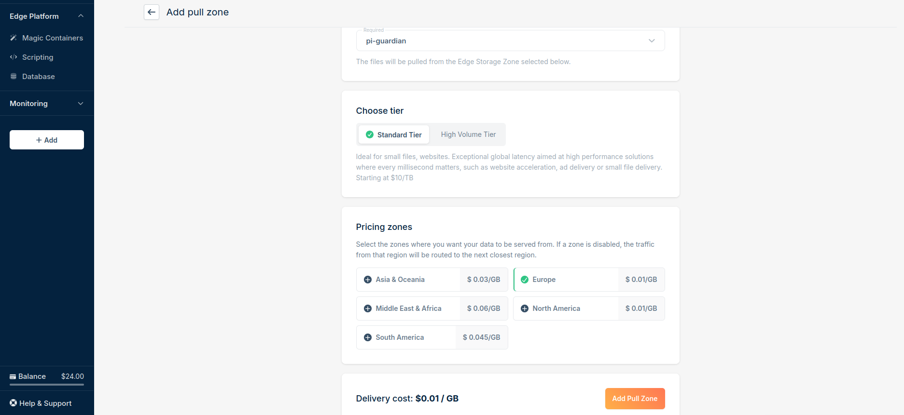

got my own cdn url pi-guardian.b-cdn.net:
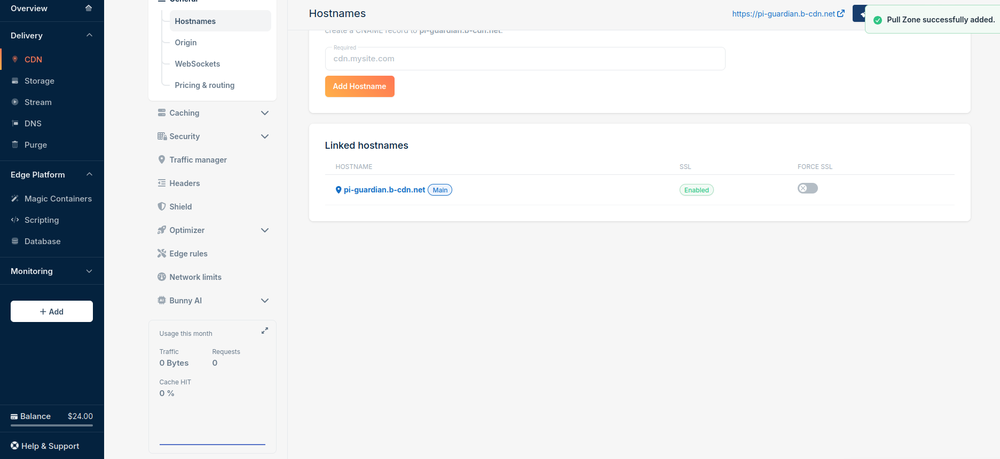

went to the stream tab and started setting up a library:
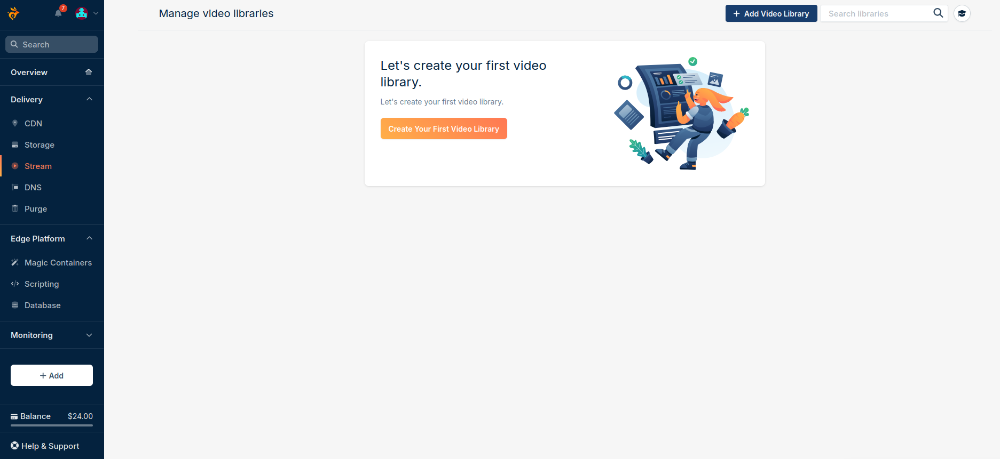

named it pi-guardian-recordings
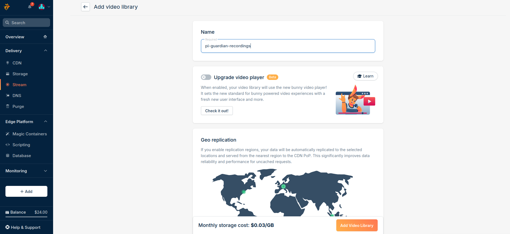

went with 1 zone and created the video library:
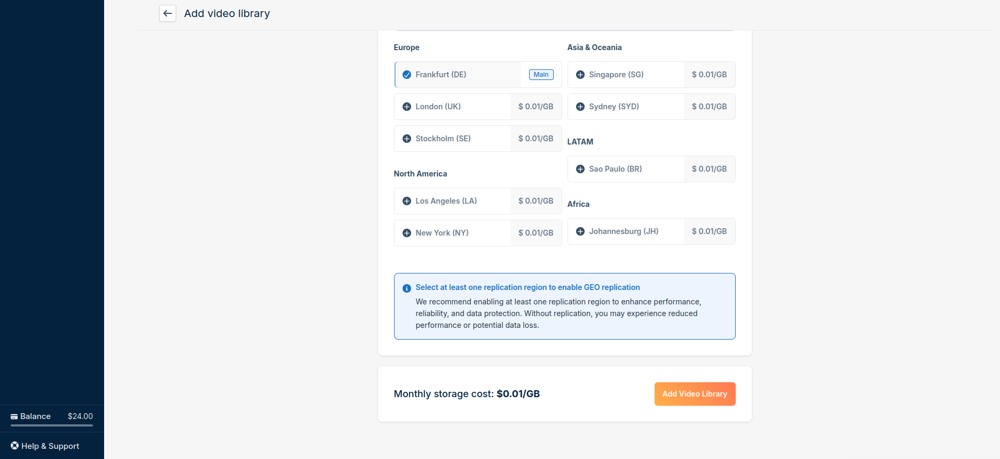

in my stream bucket I started setting up the webhook url - this is where bunny will send updates to about the recordings.
I will create a generic webhook service to route webhooks:
https://pi-guardian.kcolville.com/api/webhooks

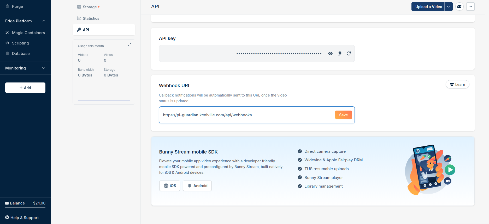

logged into my router
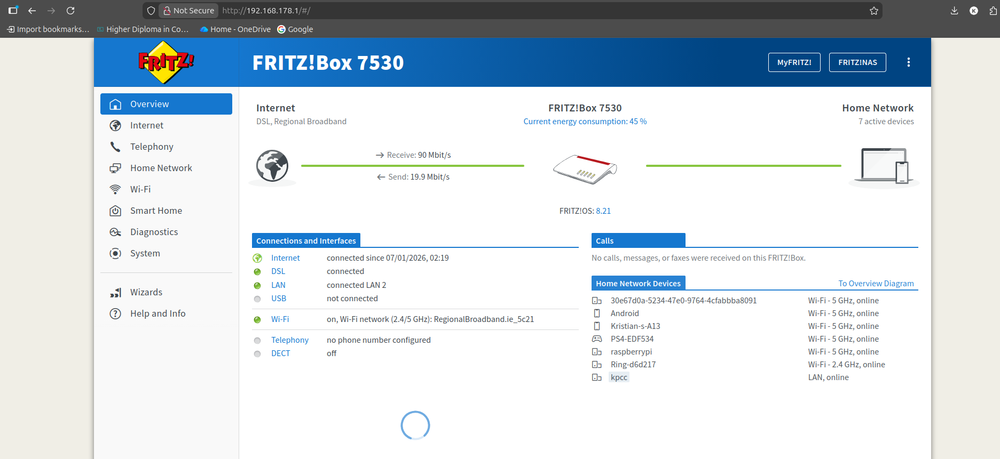

deleted the other old port forwarding on the pi and added just one to access the pi-guardian externally through port 80:
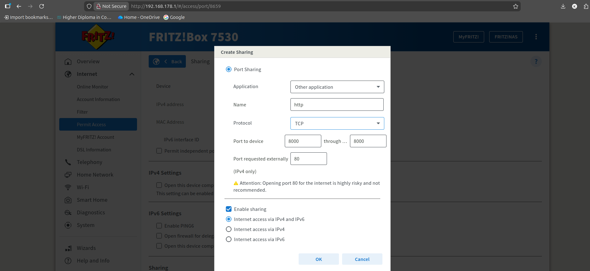

I had to go to the pi and figure out issues with my implementation and unified approach. The documentation and approach I based my idea from was based on a MVC pattern.
I didnt take into account the process requirements when I initially set it up. I assessed the startup issues and found the root cause of my problems with the camera, mqtt publishing etc.

I placed everything into fastapi and was trying to get it to manage my application. Immediately refactoring and fixing the mistake to take the server architecture into account.
When in doubt leave your desk.
all processes working unified and properly started:
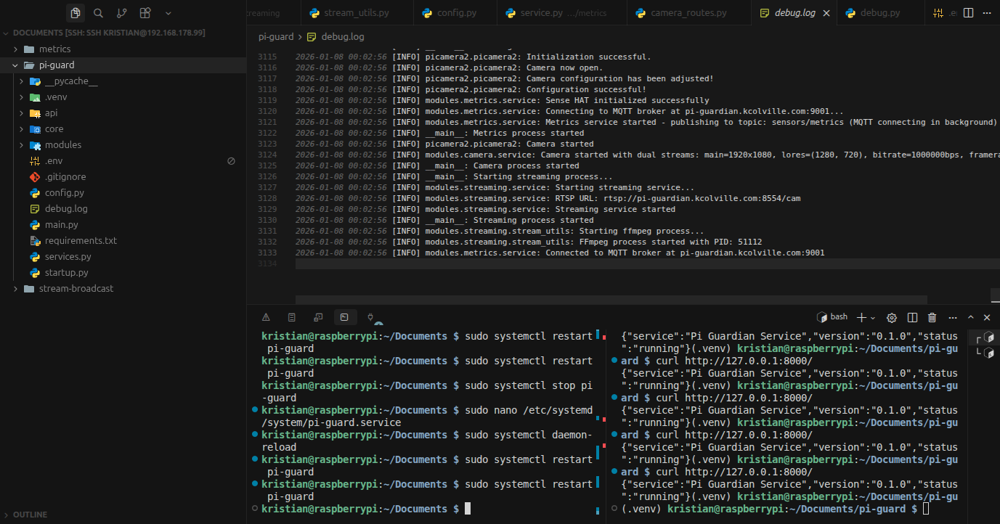

I found my issue simply by curling the python app. it would only return after i stopped or restared.
I updated the systemd to run the startup.py instead of the main.py

Very excited to finally see this after a heart ache:
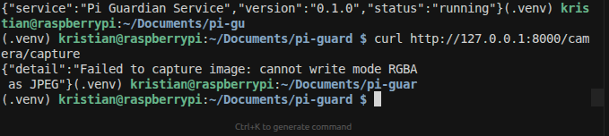

went and investigated the RGBA issue.
