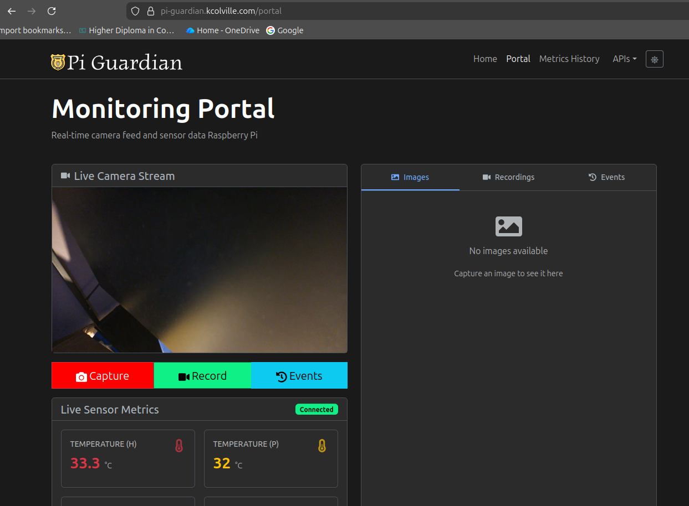

Goals today is to look into the pi manual for picamera2 in more depth for my release 3.

Basically want to carefully separate the stream into multiple channels with minimal overhead to the pi.

have a main stream for snapshots and recordings and link back more functionality to the pi guardian website.

Have the live stream maintain about 220ms latency for myself and working stable on the website.

Inform the backend of processing changes etc or new footage, pictures etc. upload the material to a sharing platform the website can use through a content delivery network.

https://pip-assets.raspberrypi.com/categories/652-raspberry-pi-camera-module-2/documents/RP-008156-DS-2-picamera2-manual.pdf?disposition=inline

improving feature set and frontend appearance:

I discovered an convenient little issue in the pi-guardian python app. The metrics stalled sending and it caused the camera to stall.
I suspect that its related as I was observing the page at the time and not coincidental.

Implementing some non blocking asynchronous logic to wrap the app in.
