Interesting development. I managed to get recordings working but now run into another problematic issue.

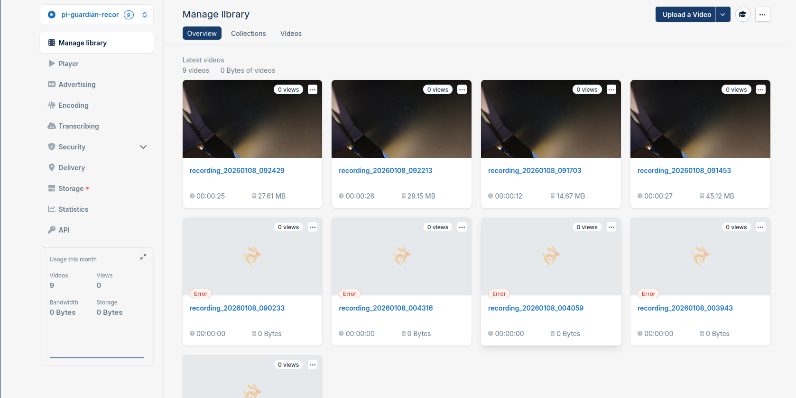

If I stop recording, it interrupts picamera2 and causes the ffmpeg process to be stuck. the camera is not available.
Very annoying, I tested stop_recording(name="main") hoping it would be that simple. No.

Starting looking into it and found an article about it that metioned continous recording but not outputting to a file.
https://www.raspberrypi.com/news/raspberry-pi-camera-module-more-on-video-capture/

I found other bits of info suggesting that this is a known limitation with the hardware and packages etc for the recording.

I can understand as its not specifically designed to do what we need to do on multiple channels.

Began implementing a pattern called the "pause recording" pattern. Its interesting.

Basically always recording, but not always writing the output and instead stopping the output to the file only and discarding the frames.

A major pain in the neck at this point in the project but only because of time limitations. Last day to finish release 3.

finally mangaged it after an hour of trial and error. confirmed camera did not fall over 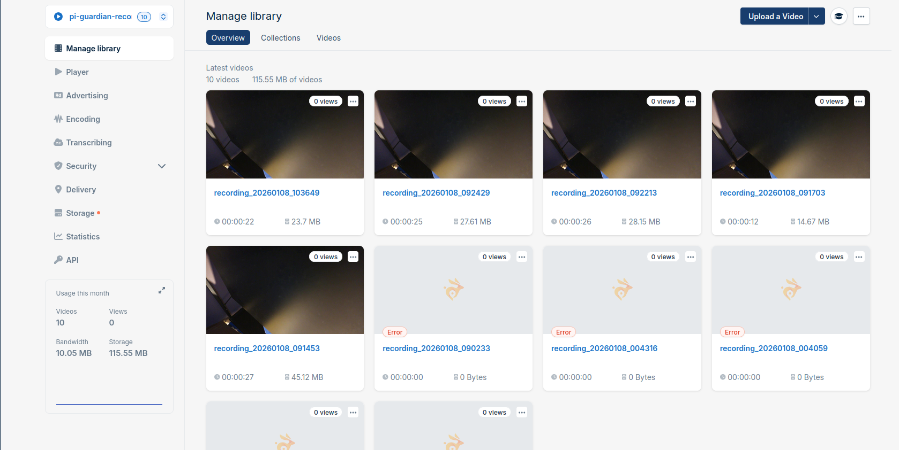

I made note to do all of this in the /tmp directory

I checked to be safe incase it was still writing, just had a recording from earlier still there and deleted that. Happy enough.
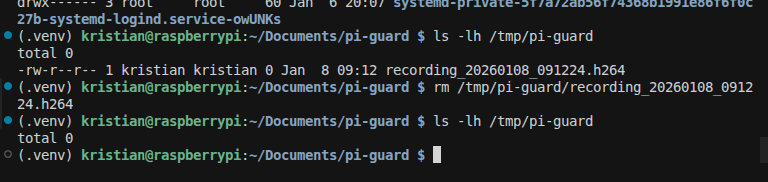

That was excellent. Not too stressed on time now. had one small issue with performing additional recordings. I was deleting files so i stopped doing using truncation instead because the file was open in the FileOutput logic.
tested multiple recordings in a row and monitored camera:
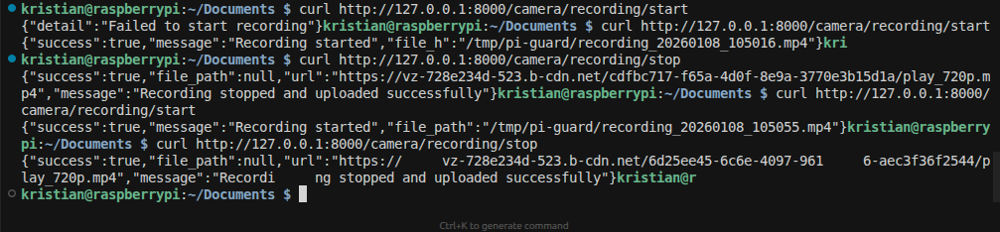

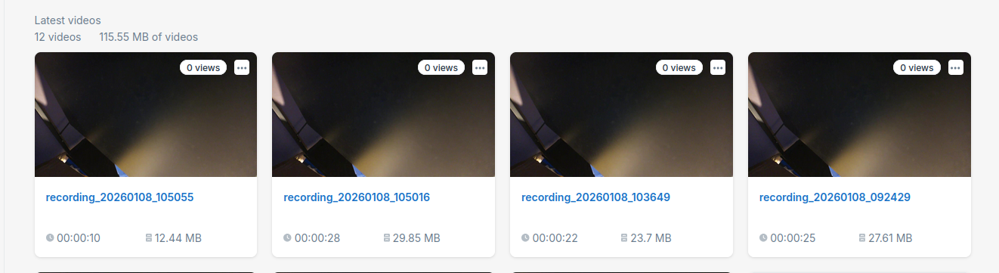

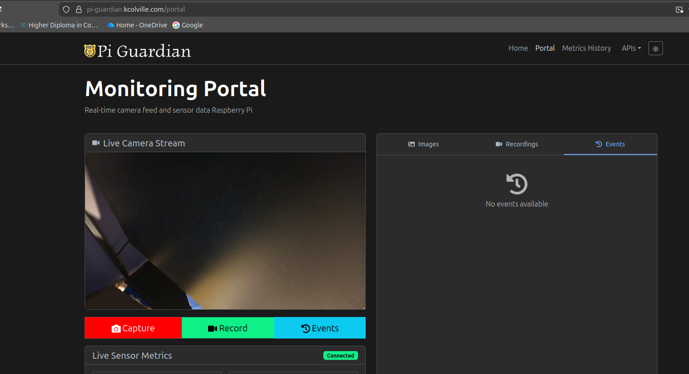

After all that hard work, I found myself a bit spent on energy for everything else to do lol.

Moving on.

Went through my goal list from lastnight to complete release 3.
Focusing on feature set for the monitoring portal.

Need to implement the webhook listener on the backend and get communication working properly between all of my components.

to put it plainly the static assets thats easy to manage, the pi just needs to tell the backend the path to the files for static that were created.
The backend just uses stores the paths and the frontend references these. I'm not spending time on securing this for project purposes its fine. requires URL signing.
Will make public and make note that it should be secured as well as all of the other security things I delibertly skipped over.

Recordings is bit more difficult, we are creating a container on bunny to put the recording into, paths dont matter its S3 like so everything is flat.
What we do get is a video_guid ID to use we need to pass back to the backend to let it know we did that and how it faired on the pi side.

Then bunny should send webhooks with various codes to let us know the encoding status etc.

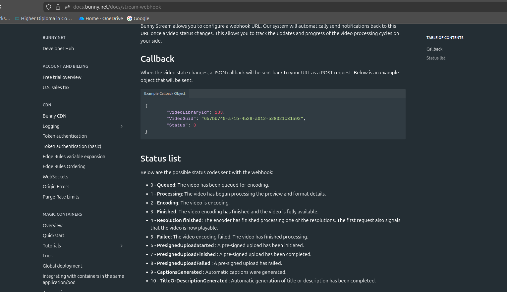

If we have enough time we can setup a small custom websocket between the backend and frontend for live updates instead of polling the backend.

I'd rather have a channel to post updates to that the frontend can parse especially when your doing on demand functionality like capturing and recordings.

As with anything you need to do you need to be motivated. I put on my headphones found a good tune and ramped myself to get going again with pace.
The CI/CD pipeline I implemented early is going to pay off dramatically today.

part 2: hooking up my hard work
I knew that No-IP would come in handy. can remotely tell the pi what to do now from backend
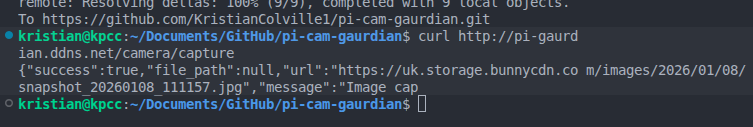

created a jwt for the server and updated small bit of security after the default setup:
https://secretkeygen.vercel.app/

setup getting openapi spec from pi-guard for the rasberry pi:
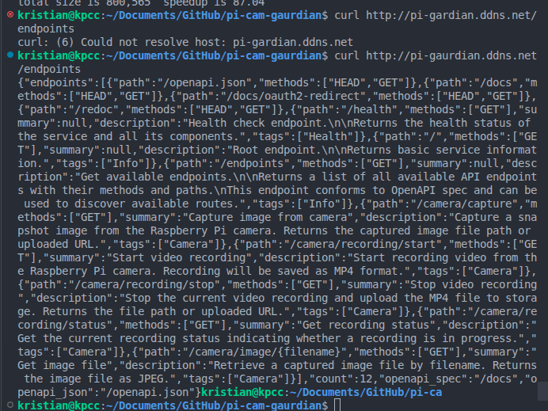

I spent a few hours working on the backend with 2 new entities and storage module.

Got setup of course wrong method type:
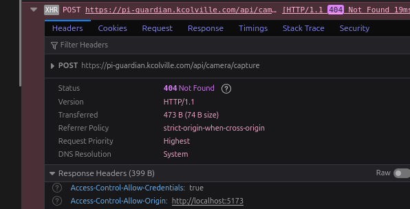

api guide comes in handy quick for source of truth:
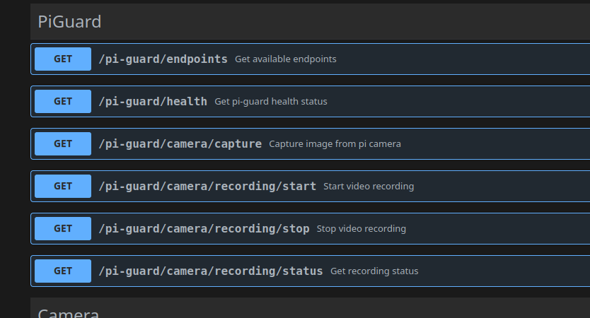

Fixed that.

It worked, working on showing actual image:
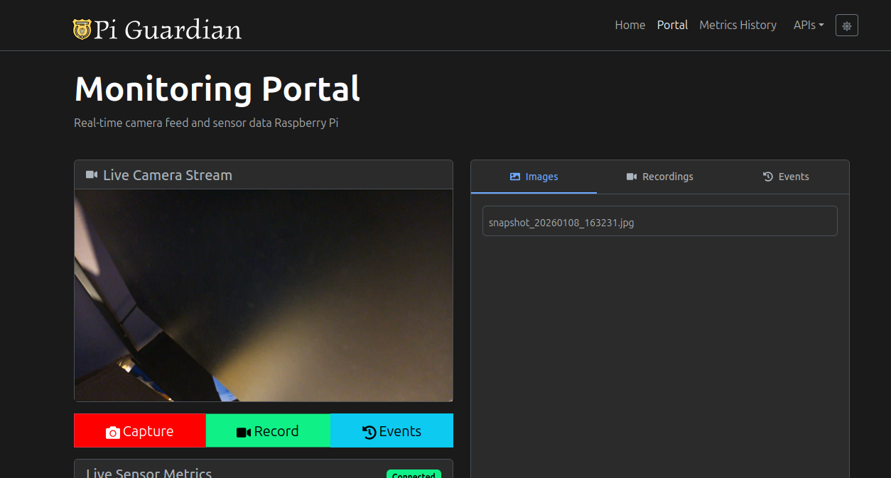

Improved the appearance of the snapshots coming out:
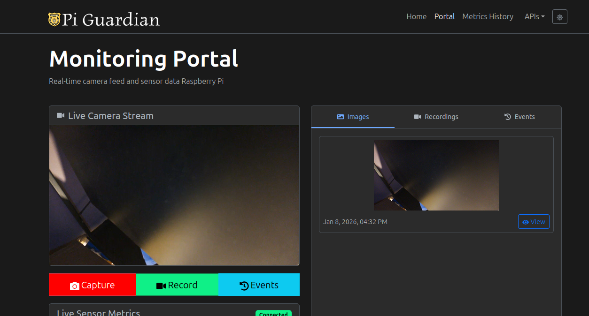

I started testing the recordings:
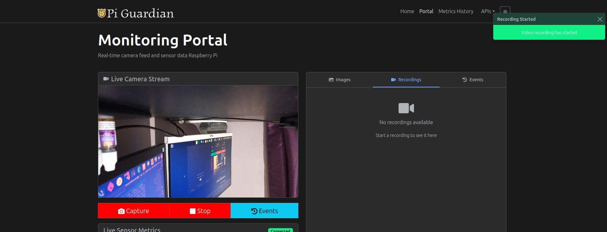Confirmed these were working:
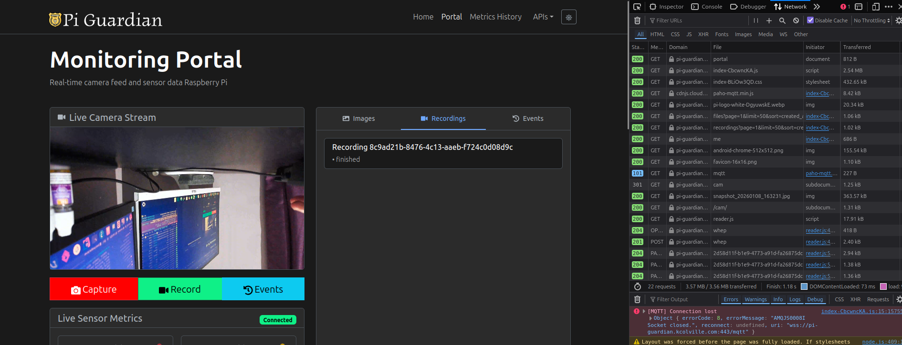

I created a react version of bunnys embed to use for my recordings.
Updated the frontend for new page storage with table of the files and recordings with pagination.

Hooked up the api spec for pi guard from the pi.

everything fine except 1 and can move on then.

size and duration have to be fetched from bunny.
