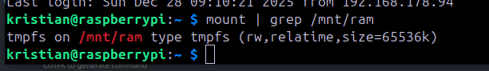
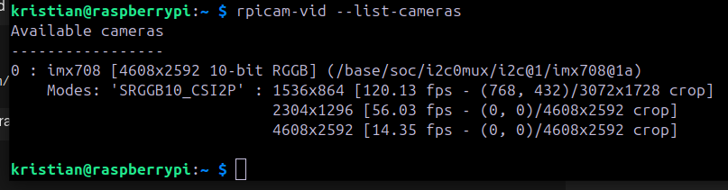
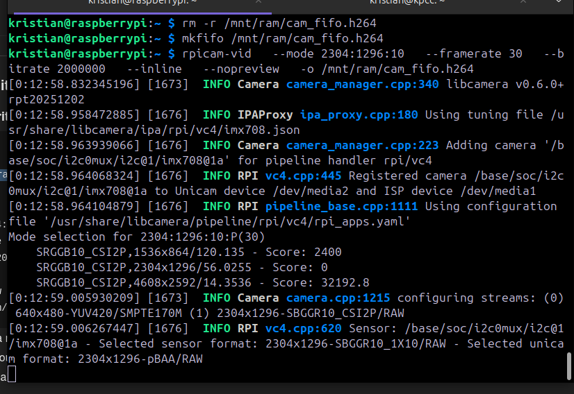
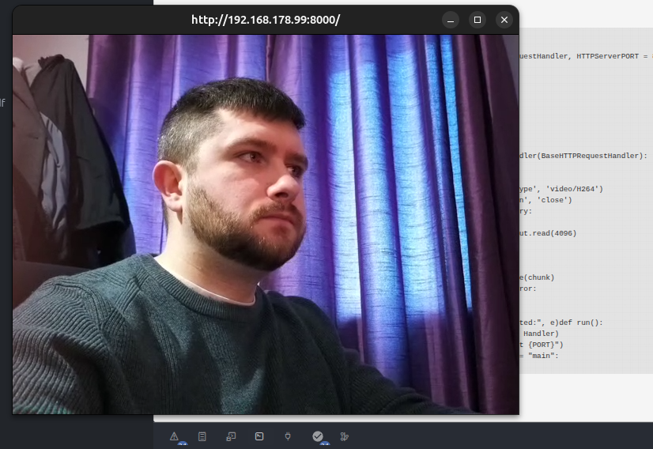
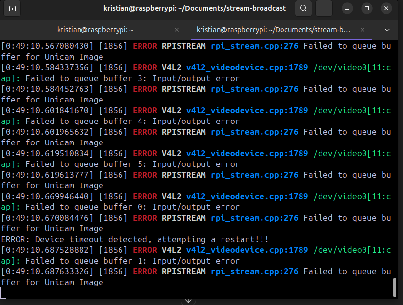
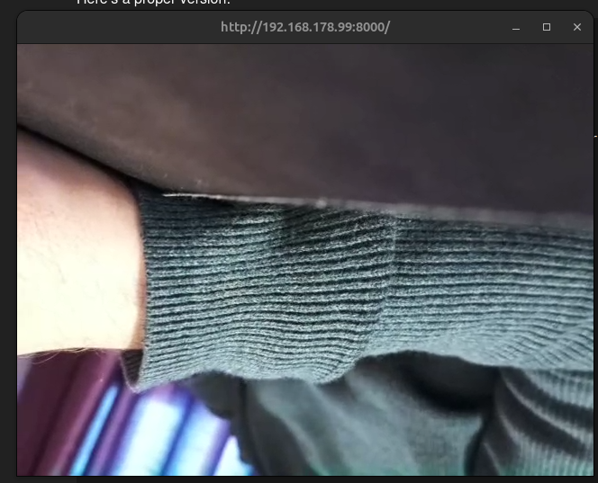

# Camera Feed Setup

**Goal:** Get the camera feed (h.264) continuously loaded so it can be pulled with low latency. Everything else is straightforward, but this is the tricky part.

## Table of Contents

- [Solution](#solution)
- [Concerns &amp; Solutions](#concerns--solutions)
- [Testing](#testing)

Came across a piping command that allows two separate processes: publishing and pulling.

The command is `mkfifo`. It differs from regular piping in that it can stay up as long as the system is up.

> "One process can open it as a reader, and the other as a writer."

**Reference:** https://en.wikipedia.org/wiki/Named_pipe

## Concerns & Solutions

**Memory Concern:** If writing to a file continuously, what about memory? Continuous writing will cause the Pi to fall over.

- **Strategy:** Write to limited temporary storage

**Latency Concern:** Read speed is an issue. Requiring the file system to fetch data adds latency because it takes time to fetch.

- **Strategy:** Write to RAM - it's highly accessible and already loaded

**Persistence Concern:** Another concern is persistence after reboot. If the Pi has to reboot that the file is continously there for the two processes.

* **Strategy:** in progress

## Testing

Came across `tmpfs` for temporary file storage. Need to test it working with the camera feed.

**Reference:** https://docs.oracle.com/cd/E19683-01/806-4073/6jd67r9j2/index.html

```bash
sudo mount -t tmpfs -o size=64M tmpfs /mnt/ram
```

This creates a 64MB RAM-based filesystem that writes data and overwrites when full.

Separate systems approach:

- **Camera system:** Points to the file and writes continuously
- **Pull system:** Reads from the file for low-latency streaming

  to persist a mount point it says online to write to /etc/fstab

  `tmpfs   /mnt/ram   tmpfs   defaults,size=64M   0 0`

  



successfully rebooted and the temporary file on ram is there ready on reboot with 64mb of ram

next part is pushing the h.264 to write to it. Need to get that connected and ensure its overwriting properly.

using the camera commands to extract info we see that the camera is composed of 3 very high quality modes 

camera now properly locked and loaded waiting for reading properly, with fifo i have no timeout issue over the rpicam-vid command:


after many issues and fifo issues i made the system even leaner, opted to just immediately publish the stream using a mockup using python script.

```python
#!/usr/bin/env python3
import subprocess
from http.server import BaseHTTPRequestHandler, HTTPServerPORT = 8000Start rpicam-vid as subprocess, writing H.264 to stdoutcamera = subprocess.Popen([
    "rpicam-vid",
    "--mode", "2304:1296:10",
    "--framerate", "30",
    "--bitrate", "2000000",
    "--inline",
    "--nopreview",
    "--timeout", "0",
    "-o", "-"
], stdout=subprocess.PIPE)class Handler(BaseHTTPRequestHandler):
    def do_GET(self):
        self.send_response(200)
        self.send_header('Content-Type', 'video/H264')
        self.send_header('Connection', 'close')
        self.end_headers()        try:
            while True:
                chunk = camera.stdout.read(4096)
                if not chunk:
                    continue
                try:
                    self.wfile.write(chunk)
                except BrokenPipeError:
                    break
        except Exception as e:
            print("Client disconnected:", e)def run():
    server = HTTPServer(("", PORT), Handler)
    print(f"Streaming camera on port {PORT}")
    server.serve_forever()if name == "main":
    run()
```



After doing this I have another immediate issue with error



after reboot I wasnt able to replicate issue, i tested stoping and starting from pc side
Works for the moment so will continue with system and refining error handling.

refined version has low latency, if re-connecting latency increases. will need to look into it.
I suspect a mixture of the high bitrate and quality and buffering on pc side, which is fine and can be edited later.

MVP of camera is successful, we are broadcasting on the network with the script:


a systemd can be setup later to automatically start this on reboot so we have a process broadcasting the camera.
