Security will be added on refinement similar to normal ip cam formats requiring username:password/ip-port like url.

I started with trying to see what quick options may be available to access the stream remotely:
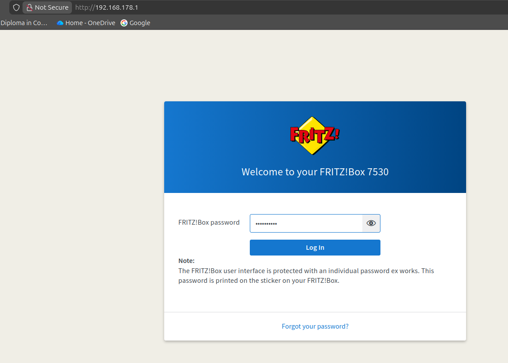

Getting setup with free account from No-IP to get a dynamic updated domain name for my stream.
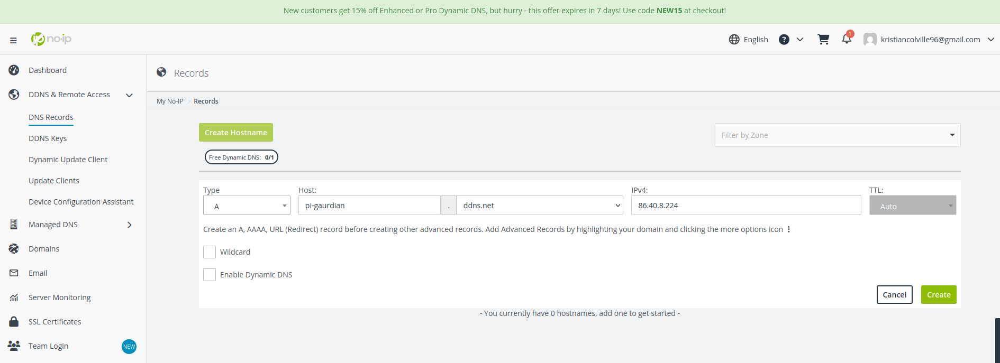

creating key to sign into it:
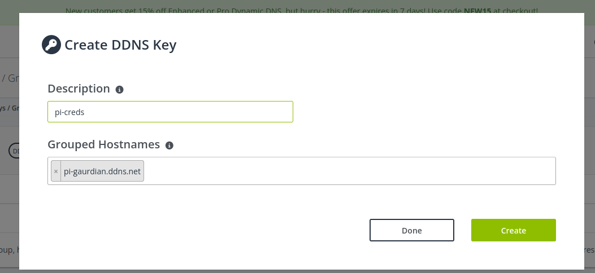

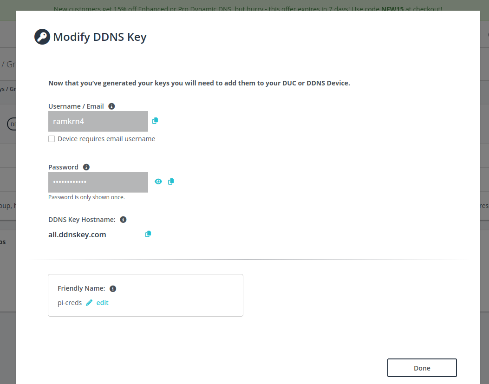

on my LAN i'm taking advantage of the features available for DNS.

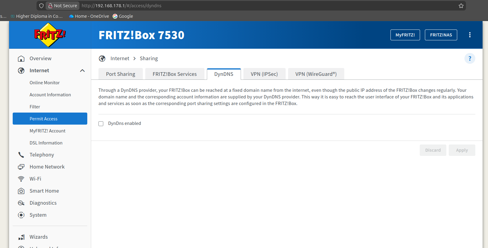

enabling port forwarding of port 8000 to external port 8000 on the modem:
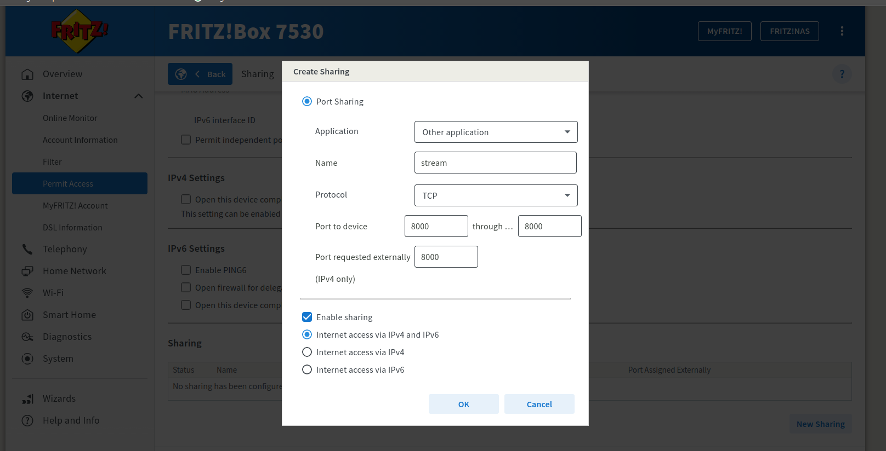

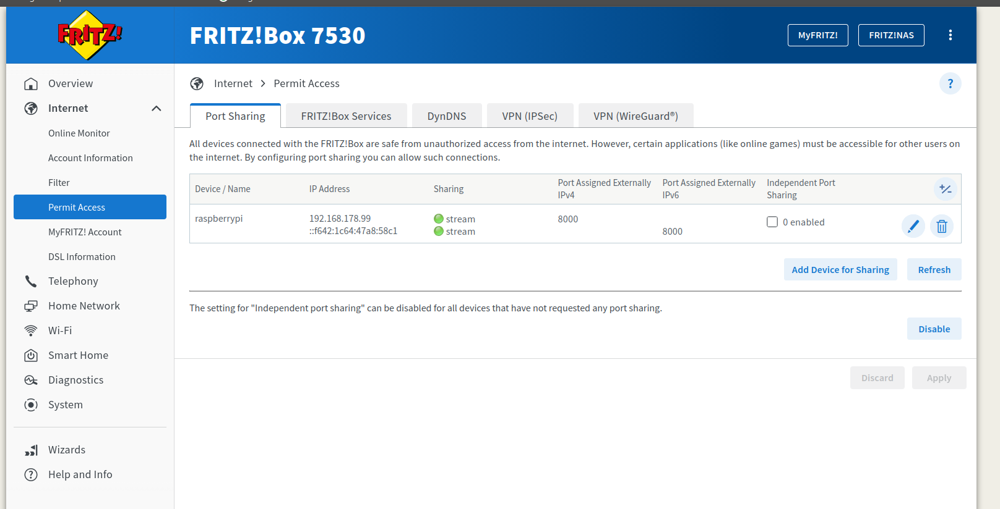

successfully pulling from ddns on port 8000. at the moment estimate 2 second delay which is fine until we refine.
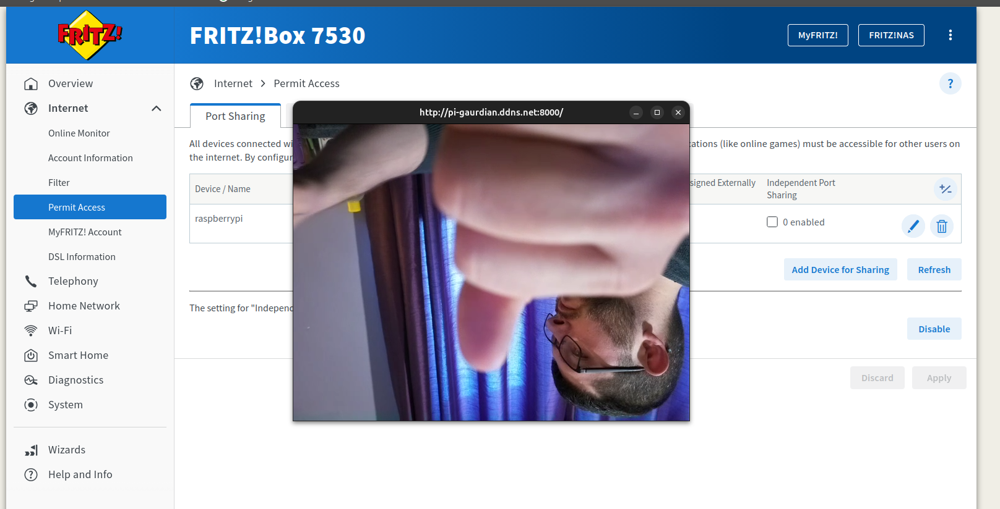

tested pinging the domain to see what latency we were experiencing on the network level.

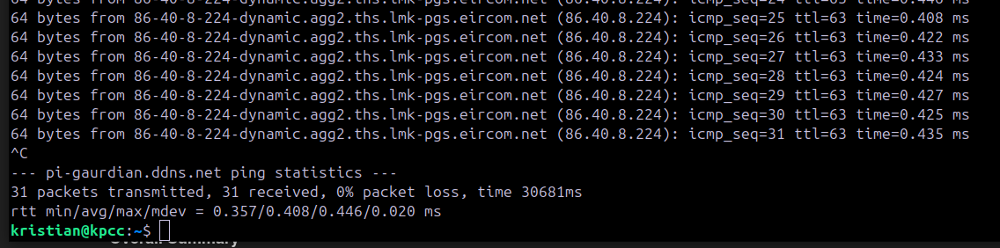

The latency is less than 1ms which suggests I am not breaking outside the router.

Going to get a server externally.

Looking into Oracle cloud free tier.

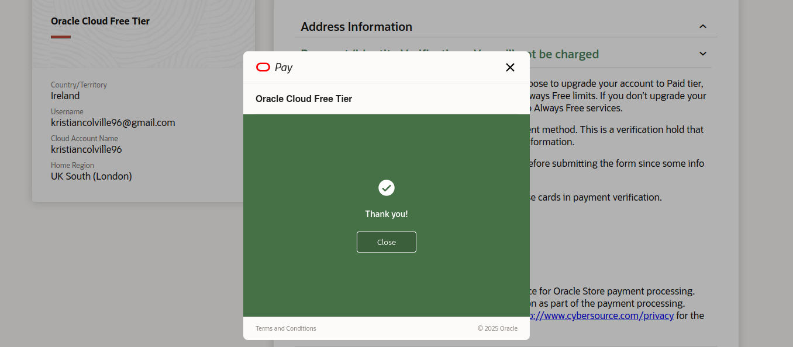

I'm in

went through the create a vm route with default settings, enabling etc along the way to get rid of errors.
Testing default setup with the free tier.
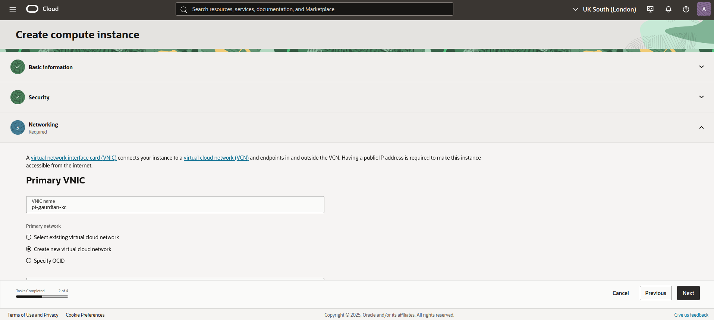

got an error at the end for getting the ssh keys

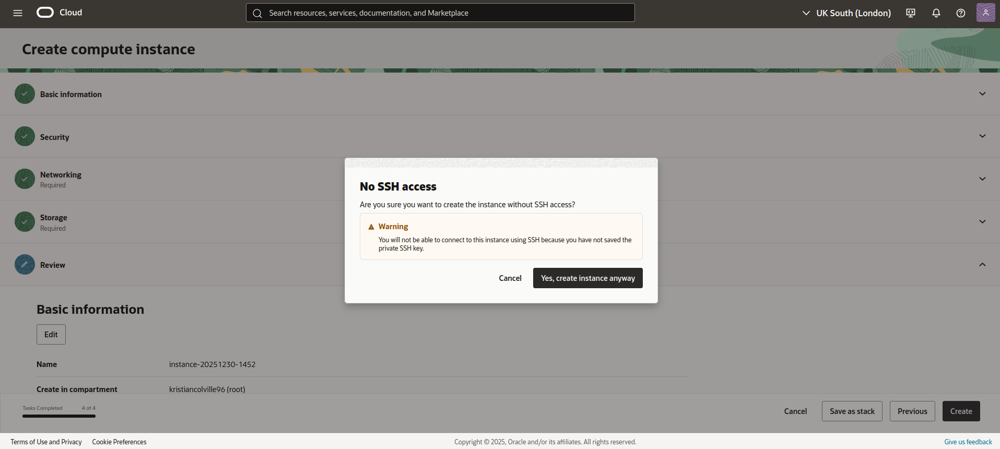

went back to networking and downloaded the keys

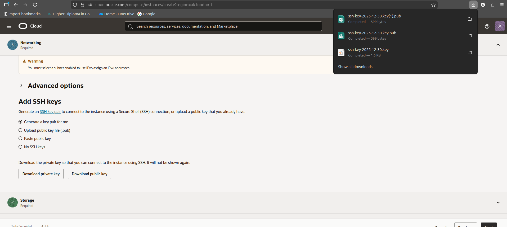

created the instance and going to setup ssh through vscode

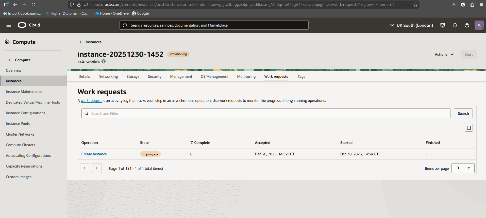

got my FQDN

Spending time to become acquainted with the portal and features.

part 2 setup vscode.

need to configure local ssh keys.

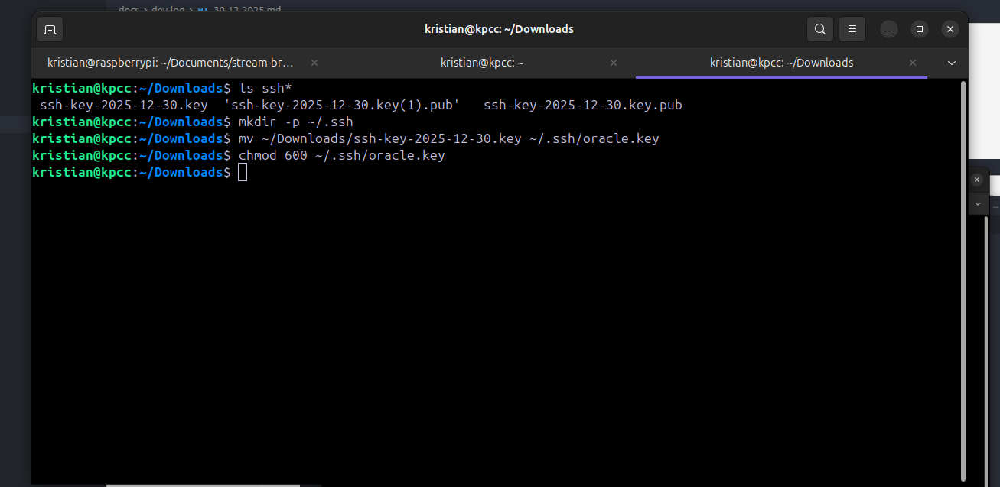

I had a missing public IP after setting up the VNIC so no public access, creating an IP on the VNIC:
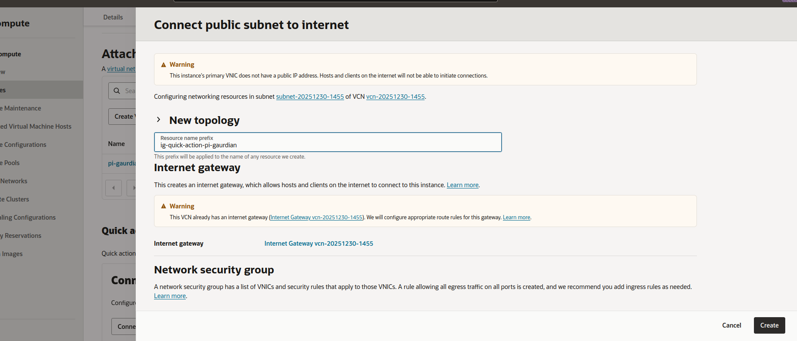

have to create the ip first and then attach the VNIC
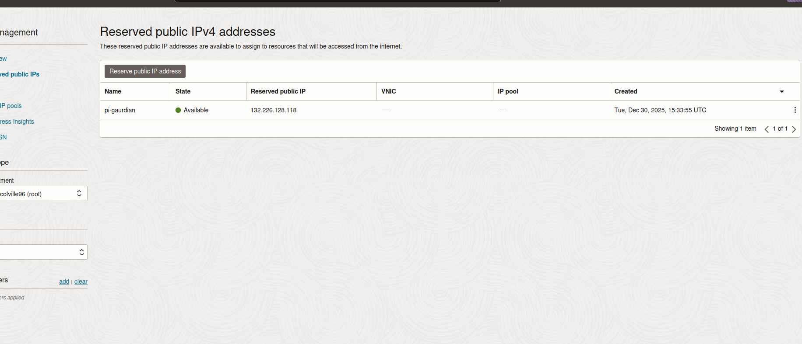

attached the reserved ip to the VNIC
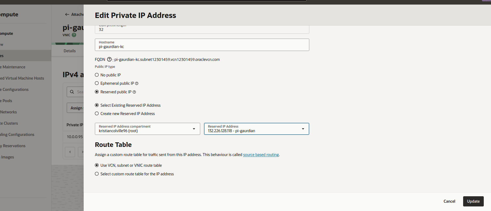

using the private key managed to test in terminal to connect successfully
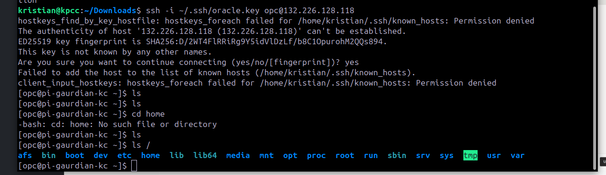

Oracle use dnf instead of apt. Updating the system and getting it prepped for ffmpeg

every command was taking too long so I terminated and restarted but added extra config. ubuntu and dedicated vps to see if that would speed things up.

got new ip and redid the keys:
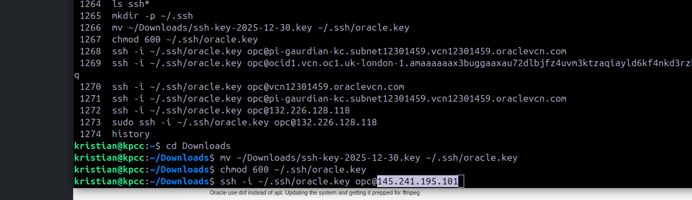

This improved speed dramatically and much more familar to work with.

installed ffmpeg on the server 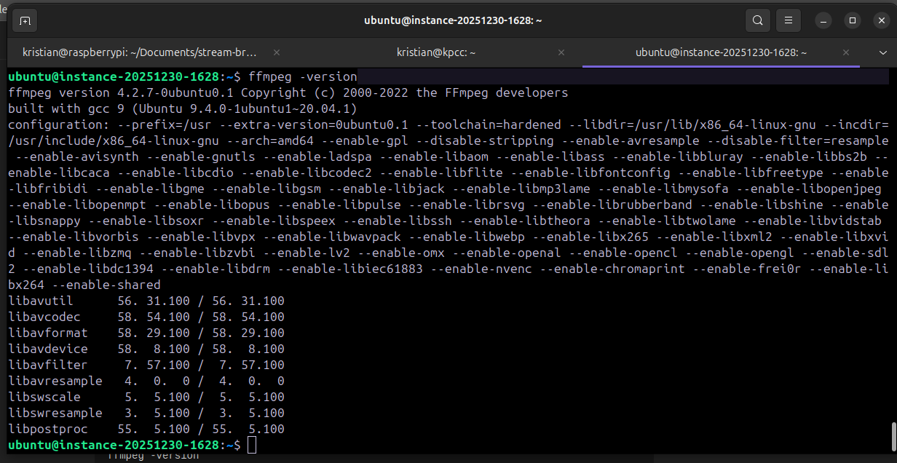
