confirmed issue experienced yesterday is port related and network issue on oracle to configure by testing network handshakes.:
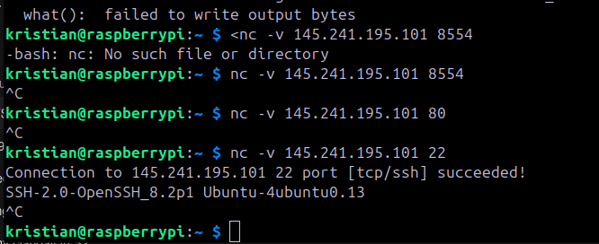

Unfortunately, or fortunately the networking setup is complex on the cloud, its not enough to open ports on the instance and gateway.
Found an interesting tool to figure out my issue on the virtual network.

https://www.youtube.com/watch?v=loOzM3M_jF4

check ports listening:
ss -nltp

discovered through documentation and video that oracle also configure on the ip table so i went in here and copied the one ssh and allowed 8554 to start with.
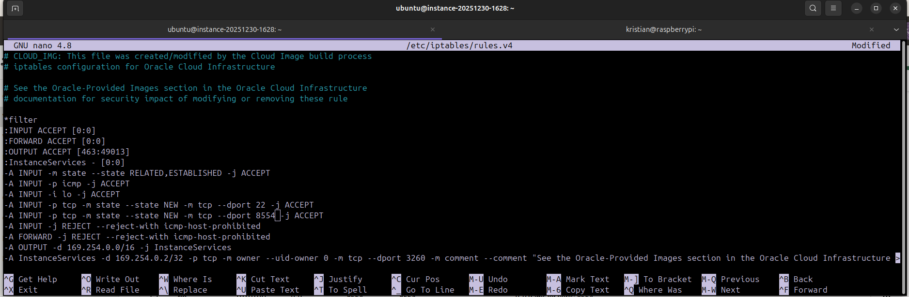

reloaded the table
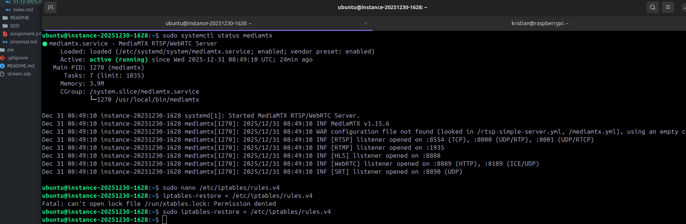

i confirmed handshake:
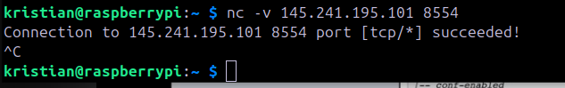

I added the mediamtx.yml with publisher to the default location and tested the stream, stream now going to the server:
paths:
  cam:
    source: publisher

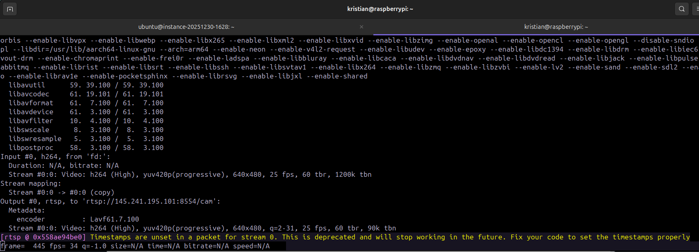

I added port 8889 and opened on network:
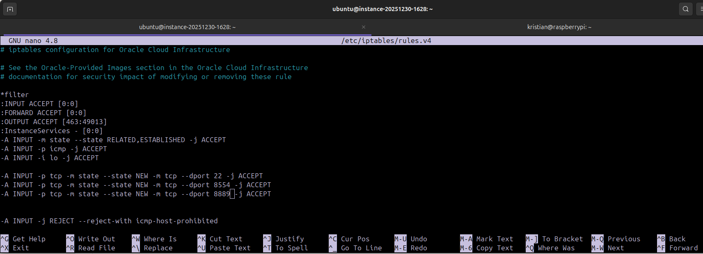

We have succesful webrtc from the server and the latency is excellent:
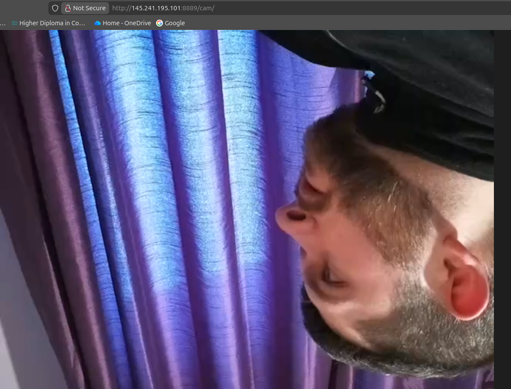

in keeping with my mantra of red light geen light (rapid prototype to optimised implementation), I need a webpage to embed iframe and show dummy data.

using webpagetest.html

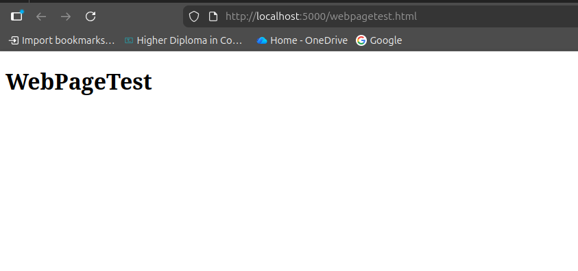

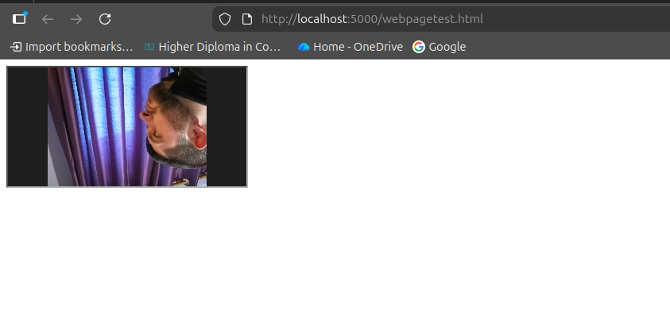

we need 16:9 for the player with height dynamic so no black borders smooth looking player.

```html
<!DOCTYPE html>
<html lang="en">
<head>
    <meta charset="UTF-8">
    <meta name="viewport" content="width=device-width, initial-scale=1.0">
    <title>WebPageTest</title>
    <style>
        body {
            box-sizing: 0;
            margin: 0;
            padding: 0;
        }
    </style>
</head>
<body>
    <div style="width: 50%">
        <div style="margin-top:4rem;margin-bottom:4rem;position:relative;width:100%;height:0;padding-bottom:56.25%;overflow:hidden;box-shadow: rgba(50, 50, 93, 0.25) 0px 50px 100px -20px, rgba(0, 0, 0, 0.3) 0px 30px 60px -30px;"><iframe src="http://145.241.195.101:8889/cam" style="position:absolute;top:0;left:0;width:100%;height:100%; border-radius: 0.5rem;overflow:hidden;"></iframe></div>
    </div>
</body>
</html>
```

adjusted the command for streaming from pi to achieve the 16:9 ratio so that the player looks decent

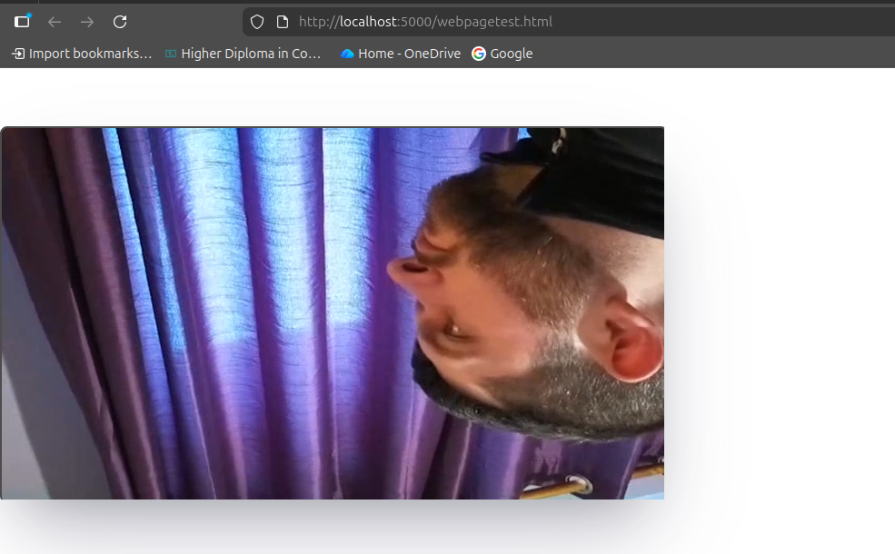

Has slightly increased the latency and the occasionally disconnects. ready to be optimised later.

```shell
rpicam-vid --mode 1280:720:10 --framerate 30 --bitrate 1000000 --inline --nopreview --timeout 0 -o - \
| ffmpeg -f h264 -i - \
    -vf "scale=1280:720" \
    -c:v libx264 -preset ultrafast -tune zerolatency -g 30 \
    -rtsp_transport tcp \
    -f rtsp rtsp://145.241.195.101:8554/cam
```

created dummy table
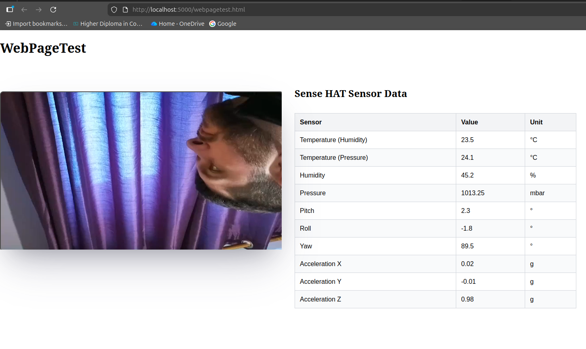

I need to add a publisher and subscriber system on the server so we can connect with websockets on the webpage and have this data be dynamically updated.
